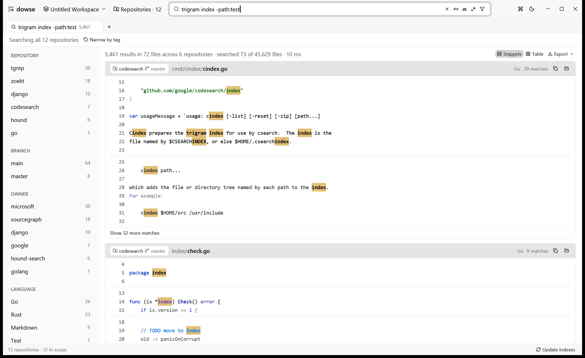
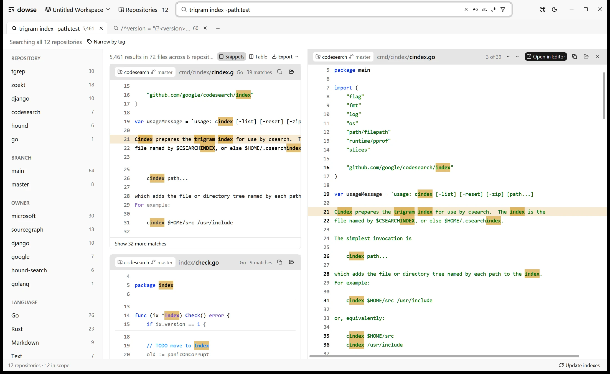
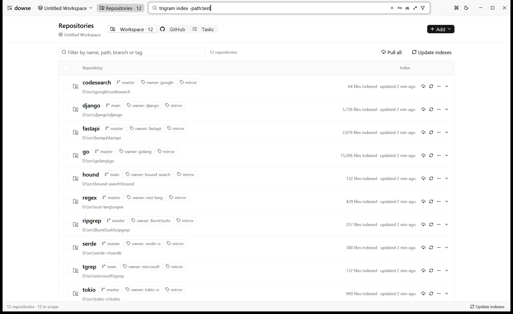

[dowse](https://github.com/HenryZhang-ZHY/dowse) searches code across many Git repositories at once, from a desktop app or the command line. It does for the clones on your own disk what [GitHub code search](https://github.com/features/code-search) and [grep.app](https://grep.app) do for GitHub: one search box, every repository, results in milliseconds. It uses the same query syntax as GitHub code search, runs on [tgrep](https://github.com/microsoft/tgrep), Microsoft's trigram-indexed grep, with one index per repository in the manner of [Zoekt](https://github.com/sourcegraph/zoekt), and needs no server.


Version 1.0 is out today for Windows, macOS and Linux. It is free and MIT-licensed.

**[Download dowse 1.0](https://github.com/HenryZhang-ZHY/dowse/releases/tag/v1.0.0)**

## The code you need is rarely in one repository

When you want to know how a function is called, where a config key is read, or which services still pin an old version of a library, the answer is usually spread over dozens of repositories: your working copies, mirrors of your team's services, the libraries you depend on. The tools for searching them each cover part of that.

- **GitHub code search** is fast and has a good query language, but it searches what is on GitHub, only [the default branch](https://docs.github.com/en/search-github/github-code-search/about-github-code-search#limitations) of each repository, and at most 100 results per search. The feature branch you are working on, the change you have not pushed, and the repositories hosted elsewhere are not in it.
- **grep.app** searches public GitHub repositories. Your company's code is not there, and should not be.
- **Sourcegraph** is the most complete code search platform, with code navigation and batch changes on top. It is also a server: someone deploys it, connects it to code hosts and keeps it running. For an engineering organization that is money well spent. For one developer on a work laptop it is a lot of infrastructure to search some folders.
- **Zoekt**, the trigram engine behind Sourcegraph's search, is open source and very fast. It too is a set of indexers and servers that you run and feed.
- **Entrian Source Search** gives Visual Studio a full-text index of your code. It lives inside the IDE, and costs a licence per developer.
- **ripgrep** and `git grep` need nothing at all, but they read every file on every search, one tree at a time. Across fifty repositories that stops being instant.

I wanted what GitHub code search gives me on github.com, over the repositories on my disk: the mirrors I keep on `main` and the working copies I develop in, uncommitted edits included. dowse is that.

## What dowse 1.0 does

### GitHub code search syntax, on your own clones

Queries are parsed as you type, in GitHub code search's syntax. Terms combine per file, not per line, so `parse config` finds files that contain both words anywhere, and shows the lines with either.

```text
parse config                      files containing both
parse OR config                   files containing either
parse NOT test                    parse, but not test
"fn main()"                       the exact text
/fn \w+_test/                     a line matching the regular expression
path:src/*.rs  language:rust      path glob, language
repo:api  branch:main             which repositories
-path:tests  -lang:md             not matching
```

A query of only qualifiers, such as `path:*.proto`, lists the files without reading them. Match case, whole word and regular expression are toggles (`Alt+C`, `Alt+W`, `Alt+R`).



Results are shown as snippets highlighted by tree-sitter grammars. Click a line to preview the whole file beside the results, step through matches with `F4`, and open the file at that line in VS Code, Cursor, Zed or Sublime Text with `Ctrl+Click`.



### Tags choose what to search; facets narrow what was found

A workspace is a set of repositories, as in VS Code, saved as a `.dowse-workspace` file. Repositories carry tags: plain ones such as `mirror` or `dev`, or `key:value` ones such as `owner:alice` or `project:billing`. Every repository is also tagged `branch:<name>` with the branch it has checked out, which updates when you switch.

The scope bar picks tags to search. Tags in one group are alternatives (`owner:alice` or `owner:bob`); groups narrow each other (`dev` and `owner:alice`). Once results are in, facets count them by repository, branch, tag, language and top-level directory, each counted under the other filters, as on grep.app.

### Search results as a table, with regex capture groups as columns

The table view (`Alt+T`) lists one row per matching line: repository, branch, path, line, column, language, the match and the line. When the query's regular expression has capture groups, each group becomes a column named after it. This query turns a search into a list of every crate version across your repositories:

```text
/^version = "(?<version>[^"]+)"/ path:Cargo.toml
```


Up to about 20,000 rows, where GitHub code search stops at 100 results. Sort by any column, then export the rows as CSV, TSV, Markdown or JSON, or paste them into a spreadsheet. Questions such as "which services still use this API" or "what log levels are configured where" become a table instead of a scroll through results.

### Clone a whole GitHub organization, and keep it current

The repositories page lists an owner's GitHub repositories through the [GitHub CLI](https://cli.github.com), so dowse never handles your credentials: run `gh auth login` once. Pages of the list are fetched in parallel; an organization of 2,000 repositories is listed in seconds. Pick some, or all shown, and dowse clones them into `<folder>/<owner>/<name>` in the background, tags them `owner:<owner>` and indexes them.

Clones are blobless by default: every commit, but only the file contents that are checked out, so large repositories clone quickly and history still works.



Give a repository a pull interval (`15m`, `1h`, `3d`) and dowse pulls it on schedule. A pull fetches `origin` and fast-forwards only when the default branch is checked out, tracked files are unchanged and there are no local commits. Otherwise it only fetches, and tells you why (`on feature/x, not main`, `uncommitted changes`). It never merges, rebases or stashes, so it is safe to point at the working copies you develop in, not only at mirrors.

## Built on tgrep, Microsoft's trigram grep

dowse's engine is [tgrep](https://github.com/microsoft/tgrep), the trigram-indexed grep Microsoft open-sourced this year, which powers the grep searches of [GitHub Copilot CLI](https://github.com/github/copilot-cli). A trigram index records which files contain each three-character sequence; a query is decomposed into trigrams, their posting lists are intersected, and only the files that can match are read and checked with the real regex engine. Zoekt works on the same idea, as did [Google Code Search](https://swtch.com/~rsc/regexp/regexp4.html) before it. In tgrep's own benchmarks, published with the project, it beat ripgrep in 17 of 18 repository and platform combinations, by up to 51.9 times.

For the screenshots in this post, dowse searches twelve public repositories cloned from GitHub: tgrep, ripgrep, Zoekt, Google codesearch, Hound, tokio, serde, regex, VS Code, Django, FastAPI and Go, 45,629 files in all. `trigram index -path:test` matches 72 files in six of them; to find them, dowse read 73 files and took 10 ms. The Cargo.toml version table took 3.2 ms. On a larger tree of 42,000 files (1.3 GB of Rust crate sources), the index builds in about 6 seconds and typical queries finish in 20–60 ms.

tgrep indexes a directory tree and searches it from the command line, or through a server it runs for that tree. dowse puts many trees behind one search box and adds what that takes: GitHub code search syntax, tags and facets across repositories, the table view, the preview, cloning and pulling. The indexes are tgrep's own, kept in each repository's `.tgrep` directory, the same place `tgrep index` and `tgrep serve` use, so dowse and the tgrep command line can share one index per repository.

## An index that stays fresh

An index is only useful if it matches the files, so dowse does not wait for a rebuild to see changes:

- A file watcher per repository tracks files changed since the last build, and searches read them directly. A `git pull` in a mirror, or an edit you saved a second ago, shows up in the next search.
- Opening a repository finds the files that changed while dowse was not running, including deleted and moved ones.
- Updating an index reads only the changed files and streams them into a copy of the index. On a 245,000-file repository with a 1.7 GB index, an update takes about 10 seconds, where a full build takes about 9 minutes. Searches keep working while it runs.

The UI is native, built with [GPUI](https://github.com/zed-industries/zed), the GPU-rendered framework behind the Zed editor; there is no browser or Electron in between.

## A command line for people and coding agents

`dowse search`, `dowse repos` and the other subcommands drive the running app, so they share its warm indexes and file watchers. If the app is not running, the first command starts it in the background, without windows.

```bash
dowse search 'parse_config lang:rust'          # every repository dowse knows
dowse search --here 'parse_config'             # only the repository you are in
dowse search -t owner:my-org -l 'LegacyClient' # paths only, one owner's repositories
dowse repos clone --from my-org --pull-every 1h
```

The output is designed for coding agents such as Claude Code, Codex and Cursor as much as for people. An agent that searches with `grep` across a large tree spends its time reading files and its context window reading output. tgrep already fixes the first half inside GitHub Copilot CLI; dowse gives any agent the same index across every repository you have, and a budget for the output:

- Results go to stdout; counts, timings and notes go to stderr. The exit status is 0 when something matched and 1 when nothing did.
- Output is capped at 100 matching lines and 20 per file, with the totals in the footer. When results are cut, the footer suggests the qualifiers that would narrow them, with how many files each keeps:

  ```text
  narrow with: repo:api (120)  language:Rust (80)  path:src/** (64)
  ```

- `--json` prints one object per matching file and a summary; `--table csv` prints the table view's rows.
- `dowse guide` prints [a short guide for agents](https://github.com/HenryZhang-ZHY/dowse/blob/master/docs/agent-guide.md). Put it in your `AGENTS.md` or `CLAUDE.md`, and the agent can search every repository you have, not just the one it was started in.

## dowse compared with tgrep, Sourcegraph, Zoekt, GitHub code search and Entrian Source Search

|  | dowse | tgrep | GitHub code search | Sourcegraph | Zoekt | Entrian Source Search |
| --- | --- | --- | --- | --- | --- | --- |
| Runs | on your machine | on your machine | on github.com | on a server you deploy | on a server you deploy | inside Visual Studio |
| Searches | many local clones, any branch, uncommitted edits | one directory tree | GitHub repositories, default branch | connected code hosts | repositories you index | files in your solution |
| Query syntax | GitHub code search | regex, grep-style | GitHub code search | Sourcegraph | Zoekt | Entrian |
| Index | trigram (tgrep), kept fresh by a watcher | trigram | GitHub's | Zoekt | trigram | full-text |
| Interface | desktop app and CLI | CLI and server | web | web | web and API | IDE panel |
| Price | free, MIT | free, MIT | included with GitHub | commercial | free, Apache-2.0 | per-developer licence |

The short version: if you want the fastest grep in one repository from a terminal, tgrep is it. If your team needs shared, organization-wide code search in a browser, use Sourcegraph or run Zoekt. If your code is all on GitHub and the default branch is enough, GitHub code search is already there. If you want to search every repository on your own machine, on whatever branch it is on, from one app and from your agent's terminal, without running a server, that is what dowse is for.

## Download dowse 1.0

Each [release](https://github.com/HenryZhang-ZHY/dowse/releases/latest) has builds ready to run, with checksums in `SHA256SUMS`:

| Platform | Download |
| --- | --- |
| Windows (x64) | `dowse-v1.0.0-windows-x86_64.zip` |
| macOS 11+ (Apple silicon and Intel) | `dowse-v1.0.0-macos-universal.zip` |
| Linux (x64, arm64) | `dowse-v1.0.0-linux-x86_64.tar.gz`, `dowse-v1.0.0-linux-aarch64.tar.gz` |

Then add the folders that hold your repositories:

```bash
dowse ~/src ~/mirrors
```

A folder that holds several Git repositories adds each of them. On Windows, the repositories page can also add "Add to dowse" to Explorer's folder menu.

The builds are not signed with a paid certificate, so Windows SmartScreen and macOS Gatekeeper ask once before the first start; the [README](https://github.com/HenryZhang-ZHY/dowse#download) explains how to allow it. To build from source, `cargo run --release` with a recent stable Rust.

## FAQ

### Is dowse a Sourcegraph alternative?

For one developer searching their own clones, yes. dowse covers Sourcegraph's core use, fast regex and literal search across many repositories, without a server. It does not replace Sourcegraph's code intelligence, batch changes or shared web UI for a team.

### Is dowse a GUI for tgrep?

In part. dowse uses tgrep's index and reads and writes the same `.tgrep` directories, so it works as a desktop front end for tgrep. It also searches many repositories in one query, parses GitHub code search syntax, and adds tags, facets, a table view, file previews, and cloning and pulling from GitHub, none of which tgrep sets out to do.

### How is dowse different from Zoekt?

Both use a trigram index. Zoekt is a search engine you run as a service and feed with indexes; dowse is an app that indexes the repositories on your disk itself, keeps the indexes current with a file watcher and incremental updates, and puts a desktop UI and a CLI in front of them.

### Can I search code locally with GitHub code search syntax?

Yes. dowse parses GitHub code search's syntax: `AND`, `OR`, `NOT`, quoted text, `/regex/`, and the `path:`, `language:`, `repo:` and `branch:` qualifiers, with `-` to negate them.

### Does dowse search uncommitted changes and other branches?

Yes. It searches the files on disk, so whatever branch a repository has checked out, and edits you have not committed, are searched. Each repository is tagged with its current branch, so `branch:main` picks the ones on `main`.

### Is there an Entrian Source Search alternative that works outside Visual Studio?

dowse is not an IDE add-in; it is a standalone app and CLI that opens results in the editor you use, VS Code, Cursor, Zed or Sublime Text among them. It searches across repositories rather than within one solution, and it is free.

### Does dowse send my code anywhere?

No. Indexes live in each repository's `.tgrep` directory, and searches run on your machine. The only network access is the Git and GitHub CLI commands you ask for: listing, cloning and pulling repositories.

---

dowse is on [GitHub](https://github.com/HenryZhang-ZHY/dowse). If it saves you time, a star helps other people find it; if something is missing or broken, [open an issue](https://github.com/HenryZhang-ZHY/dowse/issues).
