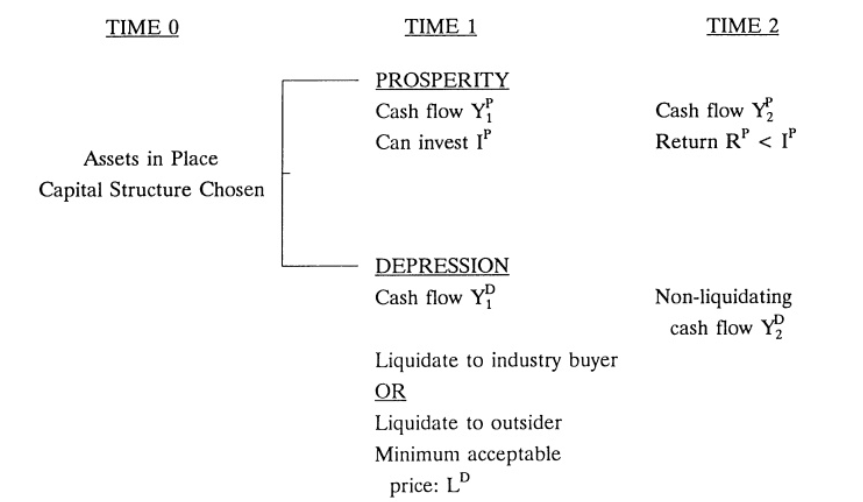
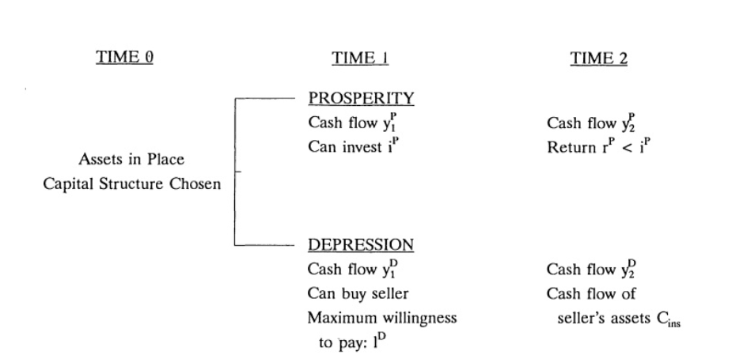

# Liquidation Values and Debt Capacity: A Market Equilibrium Approach 清算价值与债务容量：一种市场均衡方法

ANDREI SHLEIFER and ROBERT W. VISHNY

## ABSTRACT 摘要

We explore the determinants of liquidation values of assets, particularly focusing on the potential buyers of assets. When a firm in financial distress needs to sell assets, its industry peers are likely to be experiencing problems themselves, leading to asset sales at prices below value in best use. Such illiquidity makes assets cheap in bad times, and so ex ante is a significant private cost of leverage. We use this focus on asset buyers to explain variation in debt capacity across industries and over the business cycle, as well as the rise in U.S. corporate leverage in the 1980s.

本文探讨资产清算价值的决定因素，特别关注资产的潜在买家。当一家陷入财务困境的公司需要出售资产时，其行业内同行很可能自身也面临问题，导致资产以低于最佳用途价值的价格出售。这种非流动性使得资产在低迷时期变得廉价，因此在事前构成了杠杆的重要私人成本。我们利用对资产买家的关注，来解释不同行业之间以及经济周期中债务容量的差异，以及20世纪80年代美国企业杠杆率的上升。

HOW DO FIRMS CHOOSE debt levels, and why do firms or even whole industries sometimes change how much debt they have? Why, for example, have American firms increased their leverage in the 1980s (Bernanke and Campbell (1988), Warshawsky (1990)), and why has this debt increase been the greatest in some industries, such as food and timber? Despite substantial progress in research on leverage, these questions remain largely open. In this paper, we explore an approach to debt capacity based on the cost of asset sales. We argue that the focus on asset sales and liquidations helps clarify the cross-sectional determinants of leverage, as well as why debt increased in the 1980s.

企业如何选择债务水平？为什么企业甚至整个行业有时会改变其债务规模？例如，为什么美国企业在20世纪80年代提高了杠杆率（Bernanke and Campbell (1988), Warshawsky (1990)），为什么食品和木材等某些行业的债务增幅最大？尽管杠杆研究取得了实质性进展，这些问题在很大程度上仍悬而未决。在本文中，我们基于资产出售成本探讨一种债务容量方法。我们认为，关注资产出售和清算有助于阐明杠杆的横截面决定因素，以及为什么债务在20世纪80年代增加。

Williamson (1988) stresses the link between debt capacity and the liquidation value of assets. He argues that assets which are redeployable—have alternative uses—also have high liquidation values. For example, commercial land can be used for many different purposes. Such assets are good candidates for debt finance because, if they are managed improperly, the manager will be unable to pay the debt, and then creditors will take the assets away from him and redeploy them. Williamson thus identifies one important determinant of liquidation value and debt capacity, namely, asset redeployability. $ ^{1} $

Williamson (1988) 强调了债务容量与资产清算价值之间的联系。他认为，可重新配置的资产——即具有替代用途的资产——也具有较高的清算价值。例如，商业用地可用于多种不同目的。这类资产是债务融资的良好候选对象，因为如果管理不善，管理者将无法偿还债务，债权人便会收回资产并重新配置。Williamson由此确定了清算价值和债务容量的一个重要决定因素，即资产的可重新配置性。$ ^{1} $

Unfortunately, most assets in the world are quite specialized and, therefore, are not redeployable. Oil rigs, brand name food products, pharmaceutical patents, and steel plants have no reasonable uses other than the one they are destined for. When such assets are sold, they have to be sold to someone who will use them in approximately the same way. Williamson does not address the problem of such sales. This paper analyzes what prices non-deployable assets fetch in asset sales or liquidations relative to their value in best use. We call this difference between price and value in best use asset illiquidity. We argue that many assets are often illiquid, i.e., fetch prices below values in best use when liquidated, and that asset illiquidity has important implications for capital structure.

不幸的是，世界上大多数资产都相当专业化，因此不可重新配置。石油钻井平台、品牌食品、药品专利和钢铁厂除了其预定用途外，没有其他合理的用途。当这些资产被出售时，它们必须卖给那些以大致相同方式使用它们的人。Williamson没有涉及此类出售的问题。本文分析了不可重新配置资产在资产出售或清算中相对于其最佳用途价值所能获得的价格。我们将价格与最佳用途价值之间的这种差异称为资产非流动性。我们认为，许多资产通常是非流动的，即在清算时获得的价格低于最佳用途价值，并且资产非流动性对资本结构具有重要影响。

The principal reason for asset illiquidity—and the principal contribution of this paper—is the general equilibrium aspect of asset sales. When firms have trouble meeting debt payments and sell assets or are liquidated, the highest valuation potential buyers of these assets are likely to be other firms in the industry. But these firms are themselves likely to have trouble meeting their debt payments at the time assets are put up for sale as long as the shock that causes the seller's distress is industry- or economy-wide. When they themselves are hurting, these industry buyers are unlikely to be able to raise funds to buy the distressed firms' assets. Even if industry buyers can raise funds, in many cases antitrust and other government regulations might prevent them from purchasing the liquidated assets of competitors. Because of credit constraints and government regulation of industry buyers, assets would have to be sold to industry outsiders who don't know how to manage them well, face agency costs of hiring specialists to run these assets, and, moreover, fear overpaying because they cannot value the assets properly. When industry buyers cannot buy the assets and industry outsiders face significant costs of acquiring and managing the assets, assets in liquidation fetch prices below value in best use, which is the value when managed by specialists.

资产非流动性的主要原因——也是本文的主要贡献——在于资产出售的一般均衡方面。当企业难以偿付债务而出售资产或被清算时，这些资产的最高估值潜在买家很可能是行业内的其他企业。但只要导致出售方困境的冲击是行业性或经济整体性的，这些企业自身在资产被出售时也可能难以偿付债务。当行业买家自身也受到冲击时，它们不太可能筹集到资金来购买困境企业的资产。即使行业买家能够筹集资金，在许多情况下，反垄断和其他政府监管也可能阻止它们购买竞争者的清算资产。由于行业买家面临的信贷约束和政府监管，资产不得不卖给行业外部人——他们不擅长管理这些资产，面临雇佣专家运营这些资产的代理成本，而且由于无法对资产进行合理估值而担心支付过高的价格。当行业买家无法购买资产，而行业外部人面临收购和管理资产的显著成本时，清算中的资产获得的价格低于最佳用途价值，即由专家管理时的价值。

This result contrasts with the view expressed by many academic lawyers (e.g., Baird (1986)) that conducting an immediate auction is the best way to allocate the assets of distressed firms. The idea behind this claim is that auctions allocate the assets to the highest value user for the price equal to the second highest fundamental valuation. If the first and second highest valuations are reasonably close, then the auction price will be close to fundamental value in best use. In our model, in contrast, illiquid assets are not always allocated to the highest fundamental valuation users, and the auction price will not necessarily be close to the value in best use. This implies that forced liquidations can have significant private costs to the asset seller as well as significant social costs to the extent that the assets do not end up owned by the highest value user. Despite these costs, complete or partial liquidation will, in some cases, be the least costly of the various alternatives which include debt rescheduling and new equity issues. In other cases, the least costly strategy will be to continue operating under formal bankruptcy protection. We agree with Easterbrook (1990) that the policy of automatic auctions for the assets of distressed firms, without the possibility of Chapter 11 protection, is not theoretically sound.

这一结果与许多学术法律学者（如Baird (1986)）的观点形成对比，他们认为进行即时拍卖是分配困境企业资产的最佳方式。该主张背后的逻辑是，拍卖以等于第二高基本估值的价格将资产分配给最高价值使用者。如果第一和第二高估值相当接近，那么拍卖价格将接近最佳用途的基本价值。相比之下，在我们的模型中，非流动性资产并不总是被分配给最高基本估值的使用者，拍卖价格也不一定接近最佳用途的价值。这意味着强制清算不仅会给资产出售方带来显著的私人成本，而且在资产最终未能由最高价值使用者拥有时，还会产生显著的社会成本。尽管存在这些成本，在某些情况下，完全或部分清算仍将是包括债务重组和新股发行在内的各种替代方案中成本最低的。在其他情况下，成本最低的策略将是在正式破产保护下继续经营。我们同意Easterbrook (1990)的观点，即对困境企业资产实行自动拍卖而不提供第11章保护可能性的政策，在理论上是不成立的。

Our approach implies that liquidated assets are underpriced in recessions and therefore suggests that asset illiquidity is a potentially important cost of leverage. As a result, asset liquidity helps explain cross-sectional and time series financing patterns. Harris and Raviv (1991) exhaustively surveyed the theoretical literature on optimal capital structure and catalogued the relevant empirical work. While some studies have identified characteristics of individual assets that predict higher leverage, such as "tangibility" and R & D intensity, none have focused on the "general equilibrium" (industry, legal, and macroeconomic) factors that determine which assets are liquid and therefore have a higher debt capacity. Perhaps more importantly, no other work has explained major shifts in borrowing behavior over short periods of time, such as those that occurred in the United States in the 1980s.

我们的方法意味着清算资产在经济衰退中被低估定价，因此表明资产非流动性是杠杆的一项潜在重要成本。因此，资产流动性有助于解释横截面和时间序列的融资模式。Harris and Raviv (1991) 详尽地调查了最优资本结构的理论文献，并编目了相关的实证研究。虽然一些研究已经识别出预测更高杠杆的个别资产特征，如"有形性"和研发强度，但没有人关注决定哪些资产是流动的从而具有更高债务容量的"一般均衡"（行业、法律和宏观经济）因素。也许更重要的是，没有其他研究能够解释短期内借贷行为的重大转变，例如20世纪80年代美国发生的那种转变。

The first section of the paper explains the effects we have in mind, using an example of a bankrupt farmer. Section II presents a formal model, which builds on Stulz (1990) and Hart (1991). Section III discusses some extensions of the basic model. Section IV looks at the implications of the analysis for cross-sectional financing patterns, Section V presents the time series implications, and Section VI focuses on the specific case of the takeover wave and leverage increase in the 1980s. Section VII presents our conclusions.

本文第一部分通过一个破产农民的例子解释了我们所考虑的影响。第二部分基于Stulz (1990)和Hart (1991)提出了一个正式模型。第三部分讨论了基本模型的一些扩展。第四部分考察了分析对横截面融资模式的含义，第五部分呈现了时间序列含义，第六部分聚焦于20世纪80年代收购浪潮和杠杆率上升的具体案例。第七部分给出我们的结论。

## I. Determinants of Asset Liquidity: An Example 资产流动性的决定因素：一个例子

To fix ideas, consider a heavily indebted farmer whose farm is not currently generating a sufficient cash flow to cover his interest payments. Suppose that this farmer cannot reschedule his debt, issue new equity, or borrow more. He might not be able to reschedule the debt because his banker is not sure that he is really competent, and would like to foreclose and auction off the property rather than wait. He might be unable to issue new securities because of debt overhang, studied by Myers (1977), Hart and Moore (1989), and Hart (1991), and also used in the model below. Or it might be a consequence of adverse selection problems facing the potential buyers of securities, as suggested by Myers and Majluf (1984). When the farmer cannot keep the creditors away by raising more cash, the farm is liquidated.

为了确立概念，考虑一个负债累累的农民，他的农场目前产生的现金流不足以支付利息。假设这位农民无法重组债务、发行新股或借到更多资金。他可能无法重组债务，因为银行家不确定他是否真正胜任，宁愿止赎并拍卖财产也不愿等待。他可能因为债务悬置（由Myers (1977)、Hart and Moore (1989)和Hart (1991)研究，并在下文的模型中使用）而无法发行新证券。或者这可能是Myers and Majluf (1984)所指出的证券潜在买家面临的逆向选择问题的后果。当农民无法通过筹集更多现金来阻止债权人时，农场就会被清算。

There are three distinct types of potential buyers of the land. It can be sold to an outsider who would convert it to "alternative" use, such as a baseball field. It could be sold to a neighbor who would farm it himself. Or it could be sold to a financial "deep pocket" investor who would hire the current or some other farmer to farm the land, at least until he could resell it. This list of buyer types pretty much exhausts the relevant set for most assets.

土地有三种不同类型的潜在买家。它可以卖给将其转为"替代"用途的外部人，比如棒球场。可以卖给邻居，由邻居自己耕种。或者卖给一个财力雄厚的"深口袋"投资者，由他雇佣当前或其他农民来耕种这片土地，至少在他转售之前如此。这份买家类型列表几乎穷尽了大多数资产的相关集合。

Suppose that the asset, namely farmland, is converted to another use, such as the baseball field. If the land is as valuable as a baseball field as it is as a farm, this solution is very attractive in that the farmer gets a price close to the value in best use, especially if there are several bidders. Such land would be fungible, or "redeployable" in Williamson's (1988) language, and as such would be very liquid. But of course farms and other assets virtually never have alternative uses as good as the current use. The buyer in liquidation would most likely have to use the land for farming.

假设资产，即农田，被转为其他用途，比如棒球场。如果土地作为棒球场和作为农田的价值相同，这个解决方案就非常有吸引力，因为农民获得接近最佳用途价值的价格，尤其是在有多个竞标者的情况下。这样的土地将是可互换的，或用Williamson (1988)的话说是"可重新配置的"，因此将非常流动。但当然，农场和其他资产几乎从来没有像当前用途那样好的替代用途。清算中的买家最有可能不得不将该土地用于耕作。

The most likely high valuation buyer is one of the neighboring farmers. These buyers have the enormous advantage of knowing the quality of the land and perhaps even the quality of the current farmer. The adverse selection problems that might plague outsiders interested in the farm are much less important for the neighbors. Moreover, the neighbors can work the land themselves, thereby avoiding the agency problems resulting from hiring employees. In fact if the neighbors are actually allowed to bid for the farm and if they can borrow at attractive terms, they are likely to buy the farm. Competition among neighbors would ensure a price close to value in best use, making the land liquid.

最有可能的高估值买家是邻近的农民之一。这些买家拥有了解土地质量甚至当前农民能力的巨大优势。可能困扰对农场感兴趣的外部人的逆向选择问题，对邻居来说重要性要小得多。此外，邻居可以自己耕种土地，从而避免了雇佣员工所产生的代理问题。事实上，如果邻居确实被允许竞标农场，并且能够以有吸引力的条件借款，他们很可能会购买农场。邻居之间的竞争将确保价格接近最佳用途价值，使土地具有流动性。

Unfortunately, in many cases, the neighbors might not be able to bid or able to borrow at attractive terms. First, neighbors might be legally excluded from bidding because of government limits on farm size (this is obviously more relevant in the case of antitrust restrictions on companies). In addition, unless the farmer got in trouble for some idiosyncratic reason such as mismanagement, the neighbors are likely to have cash flow problems of their own at the time the farmer is distressed. They might therefore simply be unable to borrow to buy the farm, as our model below illustrates. When the neighbors cannot participate, or when they face credit constraints, the land has been sold to a "deep pocket" industry outsider, who by definition does not face as severe a credit constraint as the farmer's neighbors.

不幸的是，在许多情况下，邻居可能无法竞标或无法以有吸引力的条件借款。首先，由于政府对农场规模的限制，邻居可能被法律排除在竞标之外（在公司反垄断限制的情况下这显然更为相关）。此外，除非农民因管理不善等特殊原因陷入困境，否则在农民陷入困境时，邻居自己很可能也有现金流问题。因此他们可能根本无法借款购买农场，正如下文模型所示。当邻居无法参与，或面临信贷约束时，土地便被卖给"深口袋"行业外部人——按定义，他们不像农民的邻居那样面临严重的信贷约束。

This outsider, however, faces his own set of extra costs of buying the farm. He must worry about the quality of the farm, which he knows little about, and so is afraid to overpay. In addition, he cannot run the farm himself, and so must hire either the current farmer or someone else to run it. The agency cost further reduces the value to him relative to the value to the neighbors. Because of these adverse selection and moral hazard problems, the price that a deep pocket outsider will pay for the farm will be lower than the neighbors would pay if they were not constrained. As a result, the land will sell at a low price to the inefficient operator: a case of illiquidity.

然而，这个外部人面临自己购买农场的额外成本。他必须担心农场的质量——对此他几乎不了解——因此害怕支付过高的价格。此外，他无法自己经营农场，因此必须雇佣当前农民或其他人来经营。代理成本进一步降低了他相对于邻居的价值。由于这些逆向选择和道德风险问题，深口袋外部人愿意支付的价格将低于邻居在没有约束情况下愿意支付的价格。结果，土地将以低价出售给低效的经营者：这就是非流动性的一个案例。

The moral of the story is that the general equilibrium problem—namely, that the highest valuation buyers are likely not to be able to bid for the land—will lead to the sale of land to inefficient managers at prices below value in best use. The prospect of ex post losses of this type generates an ex ante incentive to adjust leverage to mitigate the possibility of forced asset sales at prices below value in best use.

这个故事的寓意是，一般均衡问题——即最高估值买家可能无法竞标土地——将导致土地以低于最佳用途价值的价格出售给低效管理者。这种事后损失的前景产生了事前调整杠杆的激励，以减轻以低于最佳用途价值的价格强制出售资产的可能性。

## II. The Model 模型

### A. Overview 概述

Our model is closely related to the work of Jensen (1986), Hart and Moore (1989, 1990), Harris and Raviv (1990), Stulz (1990), and Diamond (1991). The actual formulation builds on Hart (1991). $ ^{2} $ To describe the model simply, suppose we have an industry with two firms, and there are two future states of the world: prosperity and depression. In prosperity, each firm has a negative NPV investment project that its managers would like to undertake for their own personal benefit. Investors would like to keep firms from undertaking these projects. To do that, investors create a debt overhang using senior long-term debt as well as short-term debt. The short-term debt forces the firm to come to the capital market when it wants to invest, even if its cash flow is high. Long-term debt, in contrast, ensures that the firm cannot borrow in prosperity when it wants to invest because of the debt overhang. Hart thus extends the insight of Myers (1977) to show that long-term debt can be used to prevent firms from borrowing.

我们的模型与Jensen (1986)、Hart and Moore (1989, 1990)、Harris and Raviv (1990)、Stulz (1990)和Diamond (1991)的研究密切相关。实际构建建立在Hart (1991)的基础上。$ ^{2} $ 为简单描述模型，假设我们有一个包含两家企业的行业，未来有两种世界状态：繁荣和萧条。在繁荣期，每家企业都有一个负净现值的投资项目，其管理者出于个人利益想要实施。投资者希望阻止企业实施这些项目。为此，投资者利用优先长期债务和短期债务创造债务悬置。短期债务迫使企业在想要投资时进入资本市场，即使其现金流很高。相比之下，长期债务确保企业因其债务悬置而无法在繁荣期借款投资。Hart由此扩展了Myers (1977)的洞见，表明长期债务可用于阻止企业借款。

Although this combination of long- and short-term debt keeps both firms from investing in prosperity, it has a cost in the recession. Suppose that one firm is hit harder by the recession and so cannot afford to pay its short-term debt. Because of the long-term debt overhang, it cannot borrow to continue its operations. Moreover, assume that the debt cannot be rescheduled and that the firm is forced into liquidation. $ ^{3} $ Suppose that the best buyer is the other firm in the industry. But remember that the second firm itself has both short-and long-term debt, and so is most probably unable to borrow to acquire the first firm. The debt that keeps the second firm from investing in prosperity also keeps it from buying the assets of the liquidating firm in the recession. In the extreme, the second firm might be near or in liquidation itself! When the second firm cannot buy the assets of the liquidated firm, they get sold to someone outside the industry who might be an inferior operator but does not have the debt overhang. In the depression then, assets are sold to an inferior operator because the better users (other firms in the industry) are constrained in the capital market. The model thus delivers our result that optimal capital structures can lead to costly liquidation in some states of the world because all the best users of the assets are credit constrained at the same time.

尽管这种长期和短期债务的组合阻止了两家企业在繁荣期投资，但在衰退期却有成本。假设一家企业受衰退冲击更严重，因此无法支付其短期债务。由于长期债务悬置，它无法借款继续经营。此外，假设债务不能重组，企业被迫清算。$ ^{3} $ 假设最好的买家是行业中的另一家企业。但请记住，第二家企业本身既有短期债务也有长期债务，因此很可能无法借款收购第一家企业。阻止第二家企业在繁荣期投资的债务，同样阻止了它在衰退期购买清算企业的资产。在极端情况下，第二家企业本身可能接近或正处于清算之中！当第二家企业无法购买被清算企业的资产时，它们被卖给行业外的某人——可能是较差的经营者，但没有债务悬置。因此，在萧条期，资产被卖给较差的经营者，因为更好的使用者（行业中的其他企业）在资本市场上受到约束。模型由此得出我们的结论：最优资本结构可能导致在世界的某些状态下发生代价高昂的清算，因为所有资产的最佳使用者在同一时间都受到信贷约束。

### B. Details of the Model 模型细节

The model has three periods, 0, 1, and 2. There are two firms in the industry. The capital structure is determined in period 0; uncertainty is resolved in period 1, when firms have to make further decisions as well as receive and pay out some cash flow; and finally in period 2 additional cash flows are received. There are two states of the world, prosperity and depression, and uncertainty about the state is resolved in period 1. In prosperity, each firm gets a negative NPV investment opportunity that its managers want to take; hence, the agency problem. For simplicity, we assume that such an opportunity does not arise in the depression.

模型有三个时期：第0期、第1期和第2期。行业中有两家企业。资本结构在第0期确定；不确定性在第1期解决，此时企业必须做出进一步决策并收到和支付部分现金流；最后在第2期收到额外的现金流。世界有两种状态——繁荣和萧条，关于状态的不确定性在第1期解决。在繁荣期，每家企业都会获得一个其管理者想要实施的负净现值投资机会；因此产生了代理问题。为简单起见，我们假设这种机会在萧条期不会出现。

So far, the two firms are completely symmetrical. However, we assume that, in the depression, one firm is hit harder than the other with a low cash flow. As a result, the possibility arises that the harder hit firm (the seller) is liquidated, and sold to the other firm in the industry (the buyer) or an industry outsider. A key distinction between the insider and the outsider is that the cash flow of the assets of the seller in period 2 is higher under ownership by the insider. This may be because the insider is just a better operator, or because the outsider faces a bigger agency problem of hiring a manager to run these assets. We will also assume that the outsider has no debt overhang, and so can bid the full value of the firm under his management. As a result, the outsider might get the liquidating firm even if he values it less than the credit-constrained insider.

到目前为止，两家企业完全对称。然而，我们假设在萧条期，一家企业受到的冲击比另一家更严重，现金流更低。因此，可能出现受冲击更严重的企业（出售方）被清算，并出售给行业中的另一家企业（买方）或行业外部人的情况。行业内部人和外部人之间的一个关键区别是，出售方的资产在第2期的现金流在内部人所有权下更高。这可能是因为内部人就是更好的经营者，或者因为外部人雇佣管理者运营这些资产面临更大的代理问题。我们还将假设外部人没有债务悬置，因此可以出价其管理下的企业全部价值。结果，外部人可能获得被清算的企业，即使他对该企业的估值低于受信贷约束的内部人。

We first consider the capital structure of the selling firm, then the capital structure of the buying firm and finally the liquidation equilibrium. Figure 1 summarizes the timing of cash flows and decisions of the selling firm. Our notation is as follows. R is the future payoff from the investment, while I is the cost of the investment. Y is cash flow from existing assets. Superscripts refer to states, either prosperity or depression, while subscripts refer to periods 1 or 2. Note also that we assume the riskless interest rate is zero.

我们首先考虑出售方企业的资本结构，然后是买方企业的资本结构，最后是清算均衡。图1总结了出售方企业现金流和决策的时间顺序。我们的符号如下：R是投资的未来收益，I是投资的成本。Y是现有资产的现金流。上标表示状态——繁荣或萧条，下标表示时期1或2。另请注意，我们假设无风险利率为零。

We make three substantive assumptions about parameter values:

我们对参数值做出三个实质性假设：

Assumption S1: Investment in prosperity has negative net present value:

假设S1：繁荣期的投资具有负净现值：

 $$ R^{P}<I^{P}. $$

Assumption S2: Period 1 cash flow is higher in prosperity even net of the investment:

假设S2：即使扣除投资，繁荣期的第1期现金流也更高：

 $$ Y_{1}^{D}<Y_{1}^{P}-I^{P}. $$

Assumption S3: The overall cash flow is higher in prosperity than in the depression even net of the negative NPV investment:

假设S3：即使扣除负净现值投资，繁荣期的总体现金流也高于萧条期：

 $$ Y_{1}^{P}+Y_{2}^{P}+R^{P}-I^{P}>Y_{2}^{D}+Y_{1}^{D}. $$

Assumption S1 represents the agency problem and creates the need to use capital structure to control self-interested investments by management. Without S1, there is no need to use debt in the model. Assumptions S2 and S3 both say that prosperity is a much better state of the world than depression. Together they imply that a capital structure which is stringent enough to constrain managers from making bad investments in prosperity will actually put the firm into financial difficulty in the depression. If these assumptions do not hold, there will exist a capital structure that alleviates the agency costs in prosperity without entailing any distress costs in the depression. For example, if S3 holds but S2 does not, the optimal capital structure will call for a level of short-term debt that prevents the investment in prosperity but is still low enough that the firm can repay the short-term debt out of period 1 cash flow in depression. Conversely, if S2 holds but S3 does not, the first best can be obtained using long-term debt to constrain investment.

假设S1代表了代理问题，并创造了利用资本结构控制管理层自利投资的需要。没有S1，模型中就不需要使用债务。假设S2和S3都表明繁荣期是远比萧条期更好的世界状态。它们共同意味着，在繁荣期足以约束管理者进行不良投资的严格资本结构，实际上会使企业在萧条期陷入财务困境。如果这些假设不成立，将存在一种资本结构，既能减轻繁荣期的代理成本，又不会在萧条期带来任何财务困境成本。例如，如果S3成立但S2不成立，最优资本结构将要求一个短期债务水平，它既能在繁荣期阻止投资，又足够低，使得企业能在萧条期用第1期现金流偿还短期债务。反之，如果S2成立但S3不成立，则可以通过长期债务来约束投资以实现最优结果。

Hart (1991) studies the optimal period 0 capital structure when complete state-contingent contracts cannot be written. He shows that the capital structure that maximizes the wealth of period 0 shareholders, under Assumptions S1–S3, consists of senior debt $ D_{2} $ due in period 2 and debt $ D_{1} $ due in period 1. The function of junior short-term debt is to bring the firm to the capital market in period 1 rather than let it invest from the internal cash flow. Hart (1991) assumes that this debt cannot be rescheduled; we discuss this assumption in Section III. The function of senior long-term debt is to create debt overhang, so that a firm with a negative NPV investment opportunity cannot raise more money by issuing new securities. Both the long-term and the short-term debt, then, are used to discipline the management.

Hart (1991) 研究了在无法签订完全状态依赖合约时的最优第0期资本结构。他表明，在假设S1-S3下，最大化第0期股东财富的资本结构由第2期到期的优先债务 $ D_{2} $ 和第1期到期的债务 $ D_{1} $ 组成。次级短期债务的功能是在第1期将企业带到资本市场，而不是让其从内部现金流中投资。Hart (1991) 假设这些债务不能重组；我们将在第三部分讨论这一假设。优先长期债务的功能是创造债务悬置，从而使得拥有负净现值投资机会的企业无法通过发行新证券筹集更多资金。因此，长期债务和短期债务都被用来约束管理层。

To prevent investment in period 1, these debt levels must meet the following conditions in prosperity:

为阻止第1期的投资，这些债务水平必须在繁荣期满足以下条件：

Condition 1: $ I^{P} > Y_{1}^{P} - D_{1} $: After paying debt, the firm does not have enough to invest without raising capital.

条件1：$ I^{P} > Y_{1}^{P} - D_{1} $：偿还债务后，企业没有足够资金进行投资，必须筹集资本。

Condition 2: $ I^{P} - Y_{1}^{P} + D_{1} > Y_{2}^{P} + R^{P} - D_{2} $: Senior debt overhang precludes the firm from raising enough capital to invest.

条件2：$ I^{P} - Y_{1}^{P} + D_{1} > Y_{2}^{P} + R^{P} - D_{2} $：优先债务悬置使企业无法筹集足够资本进行投资。

Provided it pays initial investors to prevent the wasteful investment in prosperity (Condition 7 below), the optimal capital structure in this model calls for debt levels $ D_{1} $ and $ D_{2} $ slightly above those given by Conditions 1 and 2, i.e.,

倘若阻止繁荣期浪费性投资对初始投资者是有利的（下文条件7），本模型中的最优资本结构要求债务水平 $ D_{1} $ 和 $ D_{2} $ 略高于条件1和条件2所给出的水平，即：

Condition 3: $ D_1 = Y_1^P - I^P + \epsilon $.

条件3：$ D_1 = Y_1^P - I^P + \epsilon $.

Condition 4: $ D_{2}=Y_{2}^{P}+R^{P}+\delta. $

条件4：$ D_{2}=Y_{2}^{P}+R^{P}+\delta. $

The debt levels $ D_{1} $ and $ D_{2} $ keep the firm from making the negative NPV investment in prosperity. What do they imply about the depression? First, Condition 1 and Assumption S2 together imply

债务水平 $ D_{1} $ 和 $ D_{2} $ 阻止企业在繁荣期进行负净现值投资。它们对萧条期意味着什么？首先，条件1和假设S2共同意味着：

Condition 5: $ Y_{1}^{D} < D_{1} $: The firm cannot meet the debt payments out of the current cash flow in depression.

条件5：$ Y_{1}^{D} < D_{1} $：企业在萧条期无法用当期现金流偿还债务。

Since we have assumed that the period 1 cash flow in prosperity net of investment exceeds the cash flow in the depression, the need to go to capital markets in prosperity implies the inability to pay debt in the depression.

既然我们假设繁荣期扣除投资后的第1期现金流超过萧条期的现金流，那么在繁荣期需要进入资本市场就意味着在萧条期无法偿还债务。

Second, Condition 2 and Assumption S3 together imply

其次，条件2和假设S3共同意味着：

Condition 6: $ D_{1} - Y_{1}^{D} > Y_{2}^{D} - D_{2} $: The firm cannot postpone liquidation by raising enough cash on the capital market to pay off short-term debt.

条件6：$ D_{1} - Y_{1}^{D} > Y_{2}^{D} - D_{2} $：企业无法通过在资本市场上筹集足够现金偿还短期债务来推迟清算。

Again, since prosperity even with the bad investment is more profitable than depression, a debt overhang that keeps the firm from making the bad investment in prosperity also prevents it from raising enough money to delay liquidation in the depression. In this model, then, so long as depression is sufficiently inferior to prosperity, the firm is turned over to the creditors in the depression.

同样，既然即使带有不良投资的繁荣期也比萧条期更有利可图，那么在繁荣期阻止企业进行不良投资的债务悬置，也同样阻止企业在萧条期筹集足够资金来推迟清算。因此，在本模型中，只要萧条期足够劣于繁荣期，企业在萧条期就会被移交给债权人。

Following Hart (1991), we assume that the creditors liquidate the firm when it defaults on its short-term debt (we discuss this assumption in the next section). The main question of our analysis is at what price the firm is liquidated in the depression. From the viewpoint of the seller, the only constraint on that price is that it be high enough for the capital structure described above to be optimal. That is, the gains from avoiding the investment in prosperity must outweigh the losses from liquidation, rather than continuation, in the depression. The condition is:

遵循Hart (1991)，我们假设当企业违约其短期债务时，债权人会清算企业（我们将在下一节讨论这一假设）。我们分析的主要问题是企业在萧条期以何种价格被清算。从出售方的视角来看，对该价格的唯一约束是它必须足够高，以使上述资本结构是最优的。也就是说，在繁荣期避免投资的收益必须超过在萧条期清算（而非持续经营）的损失。该条件是：

Condition 7: $ \Pi^P(I^P - R^P) \geq \Pi^D(Y_2^D - L^D) $,

条件7：$ \Pi^P(I^P - R^P) \geq \Pi^D(Y_2^D - L^D) $,

where $ \Pi^{P} $ and $ \Pi^{D} $ are probability of prosperity and depression, respectively. This means that the minimum acceptable price, $ L^{D} $, is:

其中 $ \Pi^{P} $ 和 $ \Pi^{D} $ 分别是繁荣和萧条的概率。这意味着最低可接受价格 $ L^{D} $ 为：

Condition

条件

 $$ L^{D}=Y_{2}^{D}-\frac{\prod^{P}}{\prod^{D}}(I^{P}-R^{P}). $$

Note that liquidation in this model may well take place at a price below the value of second period cash flow under the incumbent, $ Y_{2}^{D} $, for reasons of debt overhang.

注意，由于债务悬置，本模型中的清算很可能以低于现任所有者下的第二期现金流价值 $ Y_{2}^{D} $ 的价格进行。

Hart (1991), as well as the rest of the literature, assumes that the actual liquidation value is exogenous. Our paper endogenizes this value. We assume that there are two potential buyers of the assets of the seller. First, there is an industry outsider, who can generate a second period cash flow $ C_{out} $ from these assets. We assume that this outsider does not face debt overhang and so can bid up to $ C_{out} $ for the assets. Second, there is the industry insider, "the buyer," who can generate a second period cash flow $ C_{ins} > C_{out} $ from the assets of the selling firm. Although the industry insider has a higher fundamental valuation of the liquidating firm's assets, he might not be able to pay this valuation because of his own debt overhang. The next question then is, how much can he pay?

Hart (1991) 以及其他现有文献都假设实际清算价值是外生的。本文内生化这一价值。我们假设出售方资产有两个潜在买家。第一，有一个行业外部人，他能从这些资产中产生第二期现金流 $ C_{out} $ 。我们假设该外部人没有债务悬置，因此可以为这些资产出价高达 $ C_{out} $ 。第二，有一个行业内部人——"买方"——他能从出售方企业的资产中产生第二期现金流 $ C_{ins} > C_{out} $ 。尽管行业内部人对清算企业资产具有更高的基本估值，但由于自身的债务悬置，他可能无法支付这一估值。那么接下来的问题是，他能支付多少？

To answer this question, we need to analyze the problem of the buyer. We treat the buyer almost symmetrically to the seller, except that we use small letters. So, the timing of the buyer, presented in Figure 2, is virtually the same, except that the period 2 problem in the depression is whether to buy the liquidating firm.

为回答这个问题，我们需要分析买方的问题。我们对买方的处理几乎与出售方对称，只是使用小写字母。因此，图2所示的买方时间顺序几乎相同，区别在于萧条期第2期的问题是是否购买被清算的企业。

Assumptions B1 and B3 parallel the assumptions for the seller and are used for the same reasons:

假设B1和B3与出售方的假设类似，出于同样的原因使用：

Assumption B1: Investment in prosperity has negative net present value:

假设B1：繁荣期的投资具有负净现值：

 $$ r^{P}<i^{P}. $$

Assumption B3: The overall cash flow is higher in prosperity than in the depression even net of the negative NPV investment:

假设B3：即使扣除负净现值投资，繁荣期的总体现金流也高于萧条期：

 $$ y_{1}^{P}+y_{2}^{P}+r^{P}-i^{P}>y_{2}^{D}+y_{1}^{D}. $$

However, Assumption S2 for the seller is now replaced by:

然而，出售方的假设S2现在被替换为：

Assumption B2: $ 0 < y_{1}^{D} - y_{1}^{P} + i^{P} < C_{out} $.

假设B2：$ 0 < y_{1}^{D} - y_{1}^{P} + i^{P} < C_{out} $。

The first part of the inequality is the reverse of S2; it will imply that the buyer's cash flow in the depression is high enough that he does not have to be liquidated. This assumption captures our key distinction between the buyer and the seller, namely that the former is hit less hard in the depression. If the first part of the inequality in B2 is reversed, the buyer like the seller will be liquidated and our result that assets are allocated to low valuation buyers would be even stronger. The second part of the inequality in B2 will imply that the buyer does not have enough internal cash flow to buy the seller's assets for $ C_{out} $, the outsider's valuation. If the buyer wants to get the seller's assets in the depression, he must go to the external capital market. In equilibrium, in fact, he would sometimes not be able to raise cash there either, because of debt overhang.

不等式的第一部分是S2的反面；它意味着买方在萧条期的现金流足够高，使其不必被清算。这一假设捕捉了我们关于买方和出售方之间关键区别，即前者在萧条期受到的冲击较小。如果B2中不等式的第一部分反过来，买方将像出售方一样被清算，我们的资产被分配给低估值买家的结果将更加强烈。B2中不等式的第二部分将意味着买方没有足够的内部现金流以 $ C_{out} $（外部人的估值）购买出售方的资产。如果买方想在萧条期获得出售方的资产，他必须进入外部资本市场。事实上，在均衡中，由于债务悬置，他有时也无法在那里筹集到资金。

Denote debt levels by $ d_{1} $ for short-term debt, and $ d_{2} $ for senior long-term debt. Then the levels necessary to keep the buyer from investing in prosperity satisfy:

用 $ d_{1} $ 表示短期债务水平，$ d_{2} $ 表示优先长期债务水平。那么阻止买方在繁荣期投资所需满足的水平是：

Condition 9: $ i^{P} > y_{1}^{P} - d_{1} $: the buyer needs to come to the capital market in prosperity in order to invest; and

条件9：$ i^{P} > y_{1}^{P} - d_{1} $：买方在繁荣期需要进入资本市场才能投资；以及

Condition 10: $ i^{P} - y_{1}^{P} + d_{1} > y_{2}^{P} + r^{P} - d_{2} $: Debt level is too high to raise money to invest.

条件10：$ i^{P} - y_{1}^{P} + d_{1} > y_{2}^{P} + r^{P} - d_{2} $：债务水平太高，无法筹集资金进行投资。

These conditions, of course, are exactly the same as 1 and 2 for the seller. The minimum debt levels $ d_{1} $ and $ d_{2} $ that satisfy 9 and 10 and so keep the firm from investing in prosperity are the same as those given by 3 and 4 for the seller:

这些条件当然与出售方的条件1和2完全相同。满足条件9和10从而阻止企业在繁荣期投资的最低债务水平 $ d_{1} $ 和 $ d_{2} $ 与出售方的条件3和4给出的相同：

Condition 11: $ d_{1}=y_{1}^{P}-i^{P}+\epsilon. $

条件11：$ d_{1}=y_{1}^{P}-i^{P}+\epsilon. $

Condition 12: $ d_{2}=y_{2}^{P}+r^{P}+\delta. $

条件12：$ d_{2}=y_{2}^{P}+r^{P}+\delta. $

Can the buyer burdened with $ d_{1} $ and $ d_{2} $ acquire the seller in the depression? Let $ l^{D} $ denote the maximum price such that the buyer can raise enough money to pay this price for the seller. The buyer can acquire the seller either if he has enough cash flow to do it outright in the depression or if he can raise money to do it. But the first inequality in B2 implies that the buyer does not have enough internal cash flow to buy the seller without borrowing. The buyer can borrow to buy the seller provided that:

承担着 $ d_{1} $ 和 $ d_{2} $ 债务的买方能否在萧条期收购出售方？令 $ l^{D} $ 表示买方能够筹集足够资金支付给出售方的最高价格。买方可以在萧条期有足够现金流直接购买，或者能够筹集资金购买。但B2中的第一个不等式意味着买方没有足够的内部现金流在不借款的情况下购买出售方。买方可以借款购买出售方，前提是：

Condition 13: $ l^{D} < (y_{1}^{D} + y_{2}^{D}) - (y_{1}^{P} + y_{2}^{P} + r^{P} - i^{P}) + C_{\mathrm{ins}} $.

条件13：$ l^{D} < (y_{1}^{D} + y_{2}^{D}) - (y_{1}^{P} + y_{2}^{P} + r^{P} - i^{P}) + C_{\mathrm{ins}} $。

This is the key condition of the model. Remember that the difference between the first two terms is negative under the Assumption B3 because depression cash flows are much lower than prosperity cash flows. This means that the maximum price that the buyer can afford to pay for the seller is strictly lower than the cash flow of the seller under the buyer. The reason is debt overhang: the buyer simply cannot raise money to pay the value of the seller under his management. In fact, if prosperity is much better than depression, the price the industry insider can pay might be much below the fundamental value under his management. In sum, the buyer can only buy the liquidating firm in the depression if the price is below $ l_{D} $ given by Condition 13.

这是模型的关键条件。记住，由于萧条期现金流远低于繁荣期现金流，在假设B3下前两项之差为负。这意味着买方能够支付给出售方的最高价格严格低于出售方在买方管理下的现金流。原因是债务悬置：买方根本无法筹集资金来支付出售方在其管理下的价值。事实上，如果繁荣期远好于萧条期，行业内部人能够支付的价格可能远低于其管理下的基本价值。总之，买方只有在价格低于条件13给出的 $ l_{D} $ 时，才能在萧条期购买被清算的企业。

Before analyzing who buys the firm in liquidation, we should remember that there is also a condition that says that it is in the interest of the initial owners of the buyer to create the debt overhang to avoid investment in prosperity. This condition is parallel to Condition 7 for the seller. The gains to avoiding such an investment must exceed the losses from not getting the liquidating firm in prosperity, i.e.,

在分析谁购买被清算企业之前，我们应该记住还有一个条件，即买方的初始所有者有动力创造债务悬置以避免繁荣期的投资。这一条件与出售方的条件7类似。避免此类投资的收益必须超过在萧条期未能获得被清算企业的损失，即：

Condition 14: $ \Pi^P(i^P - r^P) > \Pi^D(C_{\text{ins}} - \text{liquidation price}) $.

条件14：$ \Pi^P(i^P - r^P) > \Pi^D(C_{\text{ins}} - \text{清算价格}) $。

If the liquidating firm can be gotten for a price so low that Condition 14 fails, then the buyer's shareholders will not impose the debt overhang in period 0 because of the possibility of making a very cheap acquisition in the depression. $ ^{4} $

如果被清算企业能以如此低的价格获得以至于条件14不成立，那么买方的股东将不会在第0期施加债务悬置，因为存在萧条期捡便宜收购的可能性。$ ^{4} $

So who gets the liquidating firm? If $ l^D $, the maximum price that the industry buyer can pay, exceeds the cash flow under the outsider, $ C_{\text{out}} $, then this industry insider gets the firm for the price $ C_{\text{out}} $. He is the more efficient of the two buyers, although he might still be less efficient than the incumbent. In this case of the nonbinding debt-overhang, assets do move to the more efficient of the two potential buyers. One way to interpret this case is that the seller experiences an idiosyncratic shock, or perhaps a much more severe version of the aggregate shock than other firms in the industry, and so one of these firms manages to raise capital and acquire his assets.

那么谁获得被清算企业？如果 $ l^D $——行业买方能够支付的最高价格——超过外部人下的现金流 $ C_{\text{out}} $，那么这个行业内部人以 $ C_{\text{out}} $ 的价格获得企业。他是两个买家中效率更高的一个，尽管他可能仍不如现任所有者高效。在这种债务悬置不具约束力的情况下，资产确实转移到了两个潜在买家中效率更高的那个。解释这种情况的一种方式是，出售方经历了特质性冲击，或者经历了比行业其他企业严重得多的总体冲击，因此其中一家企业设法筹集资金并收购了其资产。

The case of most interest, however, is when the maximum price $ l^{D} $ that the buyer can pay, given by Condition 13, is below the cash flow $ C_{out} $ under the outsider, but still high enough that it is optimal for the buyer's investors to impose debt overhang (i.e., Condition 14 holds). This can occur even though the cash flow under the industry buyer exceeds the cash flow under the outsider. The firm is then sold to the outsider, who has a lower fundamental valuation but does not face credit constraints, rather than to the high valuation industry insider who has a heavy debt overhang. The firm is thus sold for a price below the second highest fundamental valuation and does not end up in the hands of the highest valuation buyer.

然而最令人感兴趣的情况是，当条件13给出的买方能支付的最高价格 $ l^{D} $ 低于外部人下的现金流 $ C_{out} $，但仍然足够高，使得买方的投资者有动力施加债务悬置（即条件14成立）。即使行业买方下的现金流超过外部人下的现金流，这种情况也可能发生。此时企业被出售给外部人——他具有较低的基本估值但不面临信贷约束——而不是出售给具有高估值但背负沉重债务悬置的行业内部人。因此，企业以低于第二高基本估值的价格出售，并且最终没有落入最高估值买家之手。

The liquidation price will be $ l^{D} $ given by Condition 13, as the industry insider loses the auction to the outsider, who ends up paying the insider's maximum ability to pay. This will be the equilibrium assuming that, at this price, the buyer and the seller are both willing to put in place the debt overhang capital structure, i.e., if Conditions 7 and 14 hold. The conclusion of this model, then, is that liquidation need not bring in the second highest fundamental valuation, but might instead bring in a lower price.

清算价格将是条件13给出的 $ l^{D} $，因为行业内部人在拍卖中输给了外部人，外部人最终支付了内部人的最高支付能力。这将是均衡状态，前提是在这个价格下，买方和出售方都愿意建立债务悬置资本结构，即条件7和14成立。因此，本模型的结论是，清算不一定会带来第二高的基本估值，而可能带来更低的价格。

In the case we have focused on above, both the buyer and the seller choose to have debt overhang, and so there is an interior debt level for both the buyer and the seller. These debt levels depend on the cash flows of the firms, and on the parameters of their investment opportunities in prosperity. So long as the equilibrium continues to be in the range where both firms use debt overhang, the levels of debt are independent of the liquidation price. However, when the liquidation price falls or rises enough, there may be a change in regimes and it may no longer be optimal for both firms to have debt overhang. For example, as $ i^{P} - r^{P} $ falls, optimal debt overhang of the industry buyer rises, the liquidation price falls, and so at some point the owners of the seller might choose to move to the no-debt capital structure. In this discontinuous way, optimal debt levels of the seller fall as the liquidity of its assets falls. In a more general model with more states, one can imagine a continuously changing capital structure, with falling levels of debt as liquidation value falls and investors would choose to allow negative NPV investments in more states rather than have more frequent liquidations. Our model thus reflects an important general principle: optimal leverage or debt capacity falls as liquidation value falls.

在我们上文聚焦的情况中，买方和出售方都选择拥有债务悬置，因此买方和出售方都有一个内部债务水平。这些债务水平取决于企业的现金流，以及它们在繁荣期投资机会的参数。只要均衡继续处于两家企业都使用债务悬置的范围内，债务水平就独立于清算价格。然而，当清算价格下降或上升足够多时，可能会发生体制变化，两家企业都拥有债务悬置可能不再是最优的。例如，随着 $ i^{P} - r^{P} $ 下降，行业买方的最优债务悬置上升，清算价格下降，因此在某个时点，出售方的所有者可能选择转向无债务资本结构。以这种不连续的方式，出售方的最优债务水平随着其资产流动性的下降而下降。在一个具有更多状态的更一般模型中，可以想象一个连续变化的资本结构：随着清算价值下降，债务水平下降，投资者会选择在更多状态下允许负净现值投资，而不是更频繁地清算。因此，我们的模型反映了一个重要的一般原则：最优杠杆或债务容量随清算价值下降而下降。

Interesting results also obtain for the parameter values at which it does not pay for both the seller and the industry buyer to have debt overhang. For some parameter values, there are two equilibria. In the first equilibrium, the buyer has a debt overhang to prevent investment in prosperity, so he cannot pay much for the liquidating firm in the depression. The liquidating firm, if it were to have debt overhang, would then get sold in depression to the industry outsider at a price equal to what the insider with the overhang can pay. Faced with the prospect of such a low price in liquidation, investors in the selling firm choose to have no debt and to allow the negative NPV investment in prosperity. This in turn makes it very attractive for the industry buyer to have a lot of debt, since the first firm is not even for sale in the depression and nothing is given up by having more debt. In this equilibrium, the buyer has a lot of debt, and the seller has none.

当参数值使得出售方和行业买方都不值得拥有债务悬置时，也会出现有趣的结果。对于某些参数值，存在两个均衡。在第一个均衡中，买方拥有债务悬置以防止繁荣期投资，因此他在萧条期无法为被清算企业支付太多。被清算企业如果拥有债务悬置，则会在萧条期以拥有悬置的内部人能够支付的价格出售给行业外部人。面对清算价格如此低的前景，出售方企业的投资者选择不持有债务，并允许繁荣期的负净现值投资。这反过来使行业买方拥有大量债务变得非常有吸引力，因为第一家企业在萧条期根本不待售，拥有更多债务不会放弃任何东西。在这个均衡中，买方有很多债务，而出售方没有。

But there is also a second possible equilibrium here. In this equilibrium, the seller has a debt overhang, and is liquidated in the depression. The buyer, however, recognizes that there is an opportunity to buy the liquidating firm in the depression at a price equal to the cash flow under the industry outsider, and therefore chooses to forego the debt overhang just to take this opportunity. The optimal debt level for the industry buyer is 0. In turn, the fact that the industry buyer is there to pay the relatively high price for the assets makes it attractive for the seller to have more debt. In this equilibrium, the seller has a lot of debt, and the industry buyer has none.

但这里还存在第二个可能的均衡。在这个均衡中，出售方拥有债务悬置，并在萧条期被清算。然而，买方认识到有机会在萧条期以等于行业外部人下的现金流的价格购买被清算企业，因此选择放弃债务悬置以抓住这个机会。行业买方的最优债务水平为0。反过来，行业买方愿意支付相对较高的资产价格这一事实，使出售方拥有更多债务变得有吸引力。在这个均衡中，出售方有很多债务，而行业买方没有。

This case of two equilibria suggests the notion of an industry debt capacity in this model. While each individual firm can have a high or a low debt level depending on which equilibrium obtains, the aggregate industry debt level is approximately the same (if the buyer and the seller are similar). Either the buyer has a lot of debt, in which case the seller chooses to have none and so avoids liquidation, or the seller has a lot of debt in which case the buyer avoids debt to be ready to acquire the seller. But it would not be an equilibrium, for these parameter values, either for both firms to have a lot of debt or for neither to have debt. The industry debt capacity reflects the desirability of both, avoiding some wasteful investment in the industry, and also of preventing the sale of liquidating firms to industry outsiders. The existence of an industry debt capacity, even when the debt capacity of any individual firm may vary widely depending on which equilibrium obtains, is perhaps the clearest example of the general equilibrium effect operating in this model.

这种两个均衡的情形暗示了本模型中行业债务容量的概念。虽然每家企业可以根据哪个均衡实现而拥有高或低的债务水平，但行业总债务水平大致相同（如果买方和出售方相似）。要么买方拥有大量债务，此时出售方选择不持有债务从而避免清算；要么出售方拥有大量债务，此时买方避免债务以准备收购出售方。但对于这些参数值，两家企业都拥有大量债务或都不持有债务都不会是均衡。行业债务容量反映了两种需求的合意性：既要避免行业中的一些浪费性投资，又要防止被清算企业出售给行业外部人。行业债务容量的存在——即使任何单个企业的债务容量可能因哪个均衡实现而大不相同——也许是本模型中运行的一般均衡效应最清晰的例子。

### C. Discussion of Illiquidity 非流动性的讨论

The conclusion of the model is that the price of an asset in liquidation might fall below value in best use because some or all industry buyers have trouble raising funds. This result relies on the assumption that the shock is either industry- or economy-wide. An idiosyncratic adverse shock to the cash flow would not have the same effect. If the seller suffers a bad idiosyncratic shock, but other firms in the industry do not, these other firms will not have a debt overhang and will compete to drive the asset price in liquidation up to the fundamental value in best use. In fact, it is trivial to extend the model to allow for idiosyncratic shocks, in which case the seller is sold to the industry buyer if he experiences an adverse idiosyncratic shock, and to the outsider if the whole industry suffers. In the first case, there is no private or social loss from liquidation, but in the second case both the private and the social loss may be large.

模型的结论是，清算中的资产价格可能低于最佳用途价值，因为部分或全部行业买家难以筹集资金。这一结果依赖于冲击是行业性或经济整体性的假设。对现金流的特质性不利冲击不会产生同样的效果。如果出售方遭受了糟糕的特质性冲击，但行业中其他企业没有，这些其他企业将没有债务悬置，并将竞争以将清算中的资产价格抬高至最佳用途的基本价值。事实上，扩展模型以允许特质性冲击是很容易的：如果出售方经历不利特质性冲击，则被出售给行业买方；如果整个行业遭受冲击，则出售给外部人。在第一种情况下，清算没有私人或社会损失，但在第二种情况下，私人和社会损失都可能很大。

The airline industry illustrates the crucial distinction between idiosyncratic and industry-wide shocks in this model. When in the mid-1980s some firms in the industry experienced idiosyncratic problems, such as Peoples' Express with overexpansion or Eastern with unions, their gates, routes, and planes were easily acquired by other airlines. More recently, when Eastern and Pan Am put their assets up for sale at a time when other airlines were themselves losing money, the potential buyers could not borrow money as easily and assets appeared to be selling at more "distressed prices." For example, in December 1991 United bought bankrupt Pan Am's Latin American routes for $135 million compared to the $215 million it had offered in late August and $342 million paid earlier to Eastern by American for similar routes.

航空业说明了本模型中特质性冲击与行业整体冲击之间的关键区别。20世纪80年代中期，当行业中一些企业经历特质性问题时——如Peoples' Express的过度扩张或Eastern的工会问题——它们的登机口、航线和飞机很容易被其他航空公司收购。更近期的，当Eastern和Pan Am在其他航空公司自身也在亏损的时候出售资产，潜在买家无法轻易借款，资产似乎以更"困境的价格"出售。例如，1991年12月，United以1.35亿美元购买了破产的Pan Am的拉丁美洲航线，而它在8月底曾报价2.15亿美元，American更早为类似航线支付给Eastern 3.42亿美元。

The institution of airline leasing seems to be designed partly to avoid fire sales of assets: airlines can stop their leasing contracts when they lose money rather than dump airplanes on the market which has no debt capacity. Even leasing companies, however, have a limited debt capacity and, therefore, cannot absorb all the planes put on the market when an industry suffers an adverse shock.

航空租赁制度似乎部分是为了避免资产的甩卖而设计的：航空公司在亏损时可以终止租赁合同，而不是将飞机抛售给没有债务容量的市场。然而，即使是租赁公司，其债务容量也是有限的，因此无法在行业遭受不利冲击时吸收市场上所有的飞机。

The oil shipping business offers another interesting example. As cash flows from that business temporarily plummeted in the mid-1980s and owners could not meet their debt payments, many tankers were selling for scrap value. At that time, astute investors from outside the industry bought some tankers and mothballed them. Mothballing the tankers may well have been the socially efficient strategy, but it seems likely that the sellers of the tankers bore a substantial private cost because they had to sell in a distressed situation where most of the informed potential buyers had little access to capital. At least in an ex post sense, the cost to the tanker sellers was large. Outside investors appear to have made a 700 percent return on their tanker investments over a five-year period.

石油航运业提供了另一个有趣的例子。当该行业的现金流在20世纪80年代中期暂时暴跌，船东无法偿还债务时，许多油轮以废品价值出售。当时，行业外精明的投资者购买了一些油轮并将其封存。封存油轮很可能是一种社会有效的策略，但油轮的出售方似乎承担了巨大的私人成本，因为他们不得不在大多数知情的潜在买家几乎没有资金渠道的困境中出售。至少从事后角度看，油轮出售方的成本是巨大的。外部投资者在五年期间似乎获得了700%的油轮投资回报。

The airline and shipping industries illustrate the critical role of deep pocket investors in maintaining some degree of asset liquidity during industry and economy-wide recessions. We expect that in bad times pools of outside money will be organized to buy the distressed assets and hold them until the industry or the economy recovers. This process would certainly reduce the private costs of illiquidity. Unfortunately, the deep pocket industry outsiders often face substantial agency and informational deterrents to aggressive investment in particular industries. In addition, when the whole economy is in a recession, many potential industries compete for the funds of deep pocket investors, which raises their opportunity costs of committing funds to particular sectors. The pools of outside money are thus unlikely to eliminate the private costs of asset illiquidity. The social costs of management by industry outsiders remain as well, although these are lower when deep pocket investors develop some industry expertise.

航空和航运业说明了深口袋投资者在行业和经济整体衰退期间维持一定程度资产流动性的关键作用。我们预期，在低迷时期，外部资金池将被组织起来购买困境资产并持有，直到行业或经济复苏。这一过程肯定会降低非流动性的私人成本。不幸的是，深口袋行业外部人在对特定行业进行激进投资时，往往面临显著的代理和信息障碍。此外，当整个经济处于衰退时，许多潜在行业竞争深口袋投资者的资金，这提高了他们将资金投入特定行业的机会成本。因此，外部资金池不太可能消除资产非流动性的私人成本。行业外部人管理的社会成本也依然存在，尽管当深口袋投资者积累了一定行业专业知识时，这些成本会较低。

It is important to stress that in many cases credit constraints of industry buyers, such as those resulting from debt overhang, are not the only factor that prevents them from buying distressed industry assets. Another potentially important barrier is regulation. For example, the United States Department of Transportation has historically prevented foreign airlines from buying assets of U.S. airlines, reducing the access of high valuation buyers to these assets and therefore reducing their prices. More importantly, antitrust regulation is an important factor that often prevents industry buyers from buying industry assets. In the 1960s, for example, it was virtually impossible to sell assets to competitors because of aggressive antitrust enforcement. These regulations have a similar effect to credit constraints: they reduce the liquidity of assets and the debt capacity for the firms in the industry.

需要强调的是，在许多情况下，行业买家的信贷约束——如债务悬置导致的——并非阻止他们购买困境行业资产的唯一因素。另一个潜在的重要障碍是监管。例如，美国交通部历来禁止外国航空公司购买美国航空公司的资产，减少了高估值买家对这些资产的接触，从而降低了其价格。更重要的是，反垄断监管是一个重要因素，经常阻止行业买家购买行业资产。例如，在20世纪60年代，由于激进的反垄断执法，将资产出售给竞争者几乎是不可能的。这些监管具有与信贷约束类似的效果：它们降低了资产的流动性和行业内企业的债务容量。

## III. Asset Sales More Generally 更一般地看资产出售

The model has provided a bare-bones illustration of how assets could be sold to a buyer with a low fundamental valuation. By focusing on the costs of asset sales, the model has missed some important issues. In particular, why do firms often choose to sell assets when debt rescheduling or raising new securities are potential alternatives? After all, asset sales are only one of several options a firm can pursue, and they must have some good properties to be chosen so often.

模型提供了一个关于资产如何被出售给低基本估值买家的简化说明。由于聚焦于资产出售的成本，模型遗漏了一些重要问题。特别是，为什么企业在可以选择债务重组或发行新证券时，经常选择出售资产？毕竟，资产出售只是企业可以追求的几种选择之一，它们必须有某些优点才会被如此频繁地选择。

A firm that does not have enough cash to meet its interest payments, or is nearing that condition, has several options. It can try to reschedule its debt, either voluntarily or in Chapter 11; it can try to raise cash by issuing new debt or equity; or it can sell assets. All these options are costly. Consider first debt rescheduling. In our analysis and in Hart (1991), it is simply disallowed by assumption. However, in this model it would sometimes pay the short-term creditors of the seller to postpone debt repayment if the liquidation is very costly, since even as junior creditors they could negotiate a mutually advantageous deal with the seller. It would also sometimes pay the short-term creditors of the industry buyer to postpone debt repayment because the acquisition of the seller is so lucrative. Debt rescheduling must have some costs that are not explicitly modeled to be avoided in these circumstances.

一家没有足够现金支付利息，或接近这种状况的企业，有几种选择。它可以尝试重组债务，无论是自愿重组还是在第11章下进行；它可以尝试通过发行新债务或股权筹集现金；或者它可以出售资产。所有这些选择都是有成本的。首先考虑债务重组。在我们的分析和Hart (1991)中，它被假设直接排除在外。然而，在本模型中，如果清算成本非常高，出售方的短期债权人有时会受益于推迟债务偿还，因为即使是作为次级债权人，他们也可以与出售方谈判达成互利协议。行业买方的短期债权人有时也会受益于推迟债务偿还，因为对出售方的收购是如此有利可图。债务重组必须有一些未在模型中明确建模的成本，才能在这些情况下被避免。

Several such costs have been discussed in the literature. First, debt rescheduling might require difficult and costly coordination between multiple creditors (Gertner and Scharfstein (1991)). Second, creditors might worry about the asset substitution problem, namely that the managers will take extra risks if the loan maturities are extended (Jensen and Meckling (1976)). These creditors would rather force liquidation than wait and risk the complete depreciation of their collateral, especially in the face of their inferior knowledge about future investment prospects and profitability. Third, creditors may suspect that the problems of the firm stem from bad management. This prospect also makes them wary of rescheduling and granting management more time. For all these reasons, debt rescheduling is often difficult.

文献中已讨论了若干此类成本。第一，债务重组可能需要多个债权人之间艰难且成本高昂的协调（Gertner and Scharfstein (1991)）。第二，债权人可能担心资产替代问题，即如果贷款期限延长，管理者会承担额外风险（Jensen and Meckling (1976)）。这些债权人宁愿强制清算，也不愿等待并冒着其抵押品完全贬值的风险，尤其是在他们对未来投资前景和盈利能力信息不足的情况下。第三，债权人可能怀疑企业的问题源于管理不善。这种可能性也使他们警惕重组和给予管理层更多时间。出于所有这些原因，债务重组通常是困难的。

What about new security issues? In our model, a security issue is simply impossible because the debt overhang from the senior long-term debt is so severe that no new securities can be issued. More generally, the uncertainty of the new security buyers about the value of the assets in place, including the quality of management, also raises the cost of security issues (Myers and Majluf (1984)). Finally, like the creditors who are wary of rescheduling the debt, buyers of new securities have to worry that the managers will squander the new cash rather than use it productively. Issuing new securities, then, is also an expensive option for the firm.

那么新证券发行呢？在我们的模型中，发行证券根本不可能，因为优先长期债务造成的债务悬置如此严重，以至于无法发行新证券。更一般地，新证券购买者对现有资产价值（包括管理质量）的不确定性也提高了证券发行的成本（Myers and Majluf (1984)）。最后，与警惕重组的债权人一样，新证券的购买者必须担心管理者会挥霍新资金，而不是有效利用它们。因此，发行新证券对企业来说也是一个昂贵的选择。

Asset sales can better deal with some of the problems that plague debt rescheduling and new security issues, and therefore sometimes become the most attractive choice.

资产出售可以更好地处理困扰债务重组和新证券发行的一些问题，因此有时成为最具吸引力的选择。

First, proceeds from asset sales are typically used to repay debt. In fact, bond covenants often require that proceeds from the sale of assets be used to pay down debt (Smith and Warner (1979), p. 127). As a result, asset sales alleviate the asset substitution problem, since creditors get cash today rather than waiting and fully exposing themselves to the riskiness of the firm.

第一，资产出售的收益通常用于偿还债务。事实上，债券契约通常要求资产出售的收益用于偿还债务（Smith and Warner (1979), p. 127）。因此，资产出售缓解了资产替代问题，因为债权人今天就能获得现金，而不是等待并完全暴露于企业的风险之中。

Second, because proceeds from asset sales not only substitute for fresh credit but also reduce creditors' exposure, creditors do not have to worry as much about the quality of the management or of its projects. Hence, the asymmetric information problem which plagues new security issues and debt rescheduling is also less severe. While asset buyers from the industry must still put a value on a portion of the firm's assets in these transactions, these are precisely the agents most capable of doing so. A key advantage of asset sales over other ways of obtaining cash or credit in financial distress is that the informational asymmetries are likely to be much smaller when dealing with informed industry insiders.

第二，由于资产出售的收益不仅替代了新信贷，还减少了债权人的风险敞口，债权人不必那么担心管理质量或其项目质量。因此，困扰新证券发行和债务重组的信息不对称问题也不太严重。虽然来自行业的资产买家在这些交易中仍需对企业部分资产进行估值，但他们恰恰是最有能力做到这一点的代理人。资产出售相对于财务困境中其他获取现金或信贷方式的一个关键优势是，在与知情的行业内部人打交道时，信息不对称可能小得多。

Third, because control over the assets is turned over to the buyers when assets are sold, these buyers, unlike the buyers of new securities, do not have to worry as much about agency problems in the management of the assets.

第三，因为在出售资产时，对资产的控制权转移给了买家，这些买家与新证券的购买者不同，不必那么担心资产管理中的代理问题。

Fourth, when asset sales generate substantial proceeds and some debt is repaid, the need for extracting concessions from many dispersed creditors is eliminated. Also, the number of creditors, and therefore the number of conflicts between creditors, usually falls. In this way as well, asset sales might be preferred to rescheduling.

第四，当资产出售产生大量收益且部分债务得以偿还时，从众多分散的债权人那里获取让步的需求就被消除了。同时，债权人的数量——以及因此债权人之间冲突的数量——通常也会减少。从这方面来说，资产出售也可能优于重组。

Finally, when a firm sells assets that are valuable, but do not generate current cash flow, it can relieve its debt burden without sacrificing its current income, or its ability to service other debt in the near future. Such assets might include businesses that are temporarily losing money, as well as growth businesses. Of course, if the industry buyers are themselves credit constrained, assets with high fundamental values but low current cash flows would sell at the largest discounts to their values: they would be the least liquid. But assuming that credit constraints are the tightest on the liquidating firm, it is probably still attractive to sell these assets. By doing so, this firm can avoid default not just immediately, but in the near future as well.

最后，当企业出售有价值但不产生当期现金流的资产时，它可以在不牺牲当期收入或近期偿还其他债务能力的情况下减轻债务负担。这类资产可能包括暂时亏损的业务以及成长型业务。当然，如果行业买家自身受到信贷约束，具有高基本价值但低当期现金流的资产将以相对其价值的最大折扣出售：它们将是最不流动的。但假设清算企业面临的信贷约束最紧，出售这些资产可能仍然具有吸引力。通过这样做，该企业不仅可以立即避免违约，也可以在不远的将来避免违约。

Overall, in some cases asset sales can lessen conflicts between creditors, reduce the asset substitution problem, control agency costs, and alleviate the informational asymmetry between the firm and outsiders, all without sacrificing the firm's ability to survive in the future. In these cases, they are the cheapest—though not a free—way to avoid complete liquidation and keep the creditors at bay. Of course, when the firm's assets are sufficiently illiquid, debt rescheduling or the issue of new securities might be the preferred alternatives, expensive as they are.

总的来说，在某些情况下，资产出售可以减轻债权人之间的冲突、减少资产替代问题、控制代理成本，并缓解企业与外部人之间的信息不对称，同时不牺牲企业未来的生存能力。在这些情况下，它们是避免完全清算和阻止债权人逼近的最便宜——尽管不是免费的——方式。当然，当企业的资产足够不流动时，债务重组或发行新证券可能是更好的选择，尽管它们也很昂贵。

## IV. Asset Liquidity and Debt Capacity 资产流动性与债务容量

Our model explains how asset illiquidity reduces the optimal amount of debt in the capital structure. While having more debt prevents inefficient investment, it also causes more frequent costly liquidation. The result might be an interior level of debt that trades off these benefits and costs. This logic has substantial implications for the cross-section of financing patterns. Specifically, illiquid assets are poor candidates for debt finance, and vice versa for liquid assets. Asset liquidity creates debt capacity because liquid assets are in effect better collateral.

我们的模型解释了资产非流动性如何降低资本结构中最优债务的规模。虽然拥有更多债务可以防止低效投资，但也会导致更频繁的代价高昂的清算。结果可能是一个权衡这些收益和成本的内部债务水平。这一逻辑对融资模式的横截面具有重要含义。具体而言，非流动性资产不适合债务融资，而流动性资产则相反。资产流动性创造债务容量，因为流动性资产实际上是更好的抵押品。

It is hard to know how big the illiquidity costs of distress are. Real estate appraisers typically assume that the rapid sale of real estate leads to price discounts of 15 to 25 percent relative to the orderly sale that might take several months. Kaplan (1989) cites Merrill Lynch estimates that the distressed sale of the Campeau retail empire would bring about 68 percent of what an orderly sale would bring. The New York Times reported that the rapid sale discount on the Trump Shuttle may be as much as 50 percent. Holland (1990) cites discounts of 50 to 70 percent off normal prices in a case study of liquidation of assets of a machine tool manufacturer.

很难知道困境的非流动性成本有多大。房地产评估师通常假设，相对于可能需要几个月的有序出售，快速出售房地产会导致15%到25%的价格折扣。Kaplan (1989) 引用美林证券的估计，Campeau零售帝国的困境出售将带来有序出售约68%的价格。《纽约时报》报道称，Trump Shuttle的快速出售折扣可能高达50%。Holland (1990) 在对一家机床制造商资产清算的案例研究中，引用了相对正常价格50%到70%的折扣。

In addition to suggesting that debt capacity is limited, our approach has a variety of implications for cross-sectional financing patterns. Liquid assets should be more extensively financed by debt. Williamson (1988) has argued that "redeployable" assets are liquid and thus are good candidates for debt finance, but this is only part of the story. Our model predicts that growth assets such as high technology firms and cyclical assets such as steel and chemical firms are illiquid because industry buyers of these assets are likely to be themselves severely credit constrained when the owners of these assets need to sell. Industry buyers of cyclical assets are constrained because they are hit by the same macroeconomic shock. Industry buyers of growth assets are virtually always credit constrained because they have so little cash relative to the value of these assets. Cyclical and growth assets are therefore poor candidates for debt finance, unless they are readily understood by deep pocket investors outside the industry.

除了表明债务容量有限之外，我们的方法对横截面融资模式还具有多种含义。流动性资产应更多地通过债务融资。Williamson (1988) 认为"可重新配置的"资产是流动的，因此是债务融资的良好候选对象，但这只是故事的一部分。我们的模型预测，成长型资产（如高科技企业）和周期性资产（如钢铁和化工企业）是非流动的，因为这些资产的行业买家在资产所有者需要出售时，自身很可能受到严重的信贷约束。周期性资产的行业买家受到约束，是因为他们受到相同的宏观经济冲击。成长型资产的行业买家几乎总是受到信贷约束，因为他们相对于这些资产的价值几乎没有现金。因此，除非它们能被行业外的深口袋投资者轻易理解，周期性资产和成长型资产不适合债务融资。

Growth and cyclical assets are usually considered to be poor candidates for debt finance because they have a high probability of a low cash flow and default on debt. But even an asset with a reasonable chance of default may have a high debt capacity if it can be easily sold for fundamental value when default occurs. If, on the other hand, cyclical and growth assets are extremely illiquid in a recession, costs of financial distress are large, and financing these assets with debt is costly. Airline gates and routes, tankers and industrial equipment are, ceteris paribus, poor candidates for debt finance precisely because industry buyers are themselves in trouble in a recession, and so these assets are highly illiquid. Illiquidity is an important reason for low debt capacity of cyclical and growth assets.

成长型和周期性资产通常被认为不适合债务融资，因为它们有很大可能出现低现金流和债务违约。但即使是具有合理违约概率的资产，如果能在违约发生时以基本价值轻易出售，也可能具有较高的债务容量。另一方面，如果周期性和成长型资产在衰退中极度不流动，财务困境的成本就很大，用债务为这些资产融资就是昂贵的。航空登机口和航线、油轮和工业设备——在其他条件相同的情况下——不适合债务融资，正是因为行业买家在衰退中自身陷入困境，因此这些资产高度不流动。非流动性是周期性和成长型资产债务容量低的重要原因。

The theory also predicts that smaller firms are ceteris paribus better candidates for debt finance. The caveat is important because small firms might be uninteresting to very many buyers, since they are too specialized, in which case the thin market reason for illiquidity might be more important than credit constraints of buyers. The way to test this prediction is to look at an industry where firms of different sizes operate together, and to see if smaller ones have more debt. Chan and Chen (1991) find that, within industry, smaller firms are more leveraged than larger firms, although they do not distinguish firms that freely choose high leverage from firms who temporarily have leverage above the long-run optimum level due to a large unanticipated drop in market value.

该理论还预测，在其他条件相同的情况下，较小的企业更适合债务融资。这一限定条件很重要，因为小企业可能由于过于专业化而无法引起许多买家的兴趣，在这种情况下，导致非流动性的市场薄弱原因可能比买家的信贷约束更重要。检验这一预测的方法是考察一个不同规模企业共同经营的行业，看较小的企业是否有更多债务。Chan and Chen (1991) 发现，在行业内部，较小的企业比较大的企业杠杆率更高，尽管他们没有区分自由选择高杠杆的企业和因市场价值大幅意外下跌而暂时使杠杆高于长期最优水平的企业。

The theory also predicts that conglomerates are better candidates for debt finance than pure plays of the same size. This is true for several reasons other than the usual reason that conglomerates tend to have lower cash flow volatility and therefore a lower probability of not being able to meet debt payments. First, a conglomerate in need of cash has the option of selling assets in several different industries. This allows the conglomerate to avoid selling assets whose underlying industries are illiquid as long as it has sufficient assets in liquid industries. Second, a conglomerate has the option of selling its assets off in smaller, more liquid pieces without adversely affecting either the value of the divested assets or the assets kept in the firm. The ease of separability and the smaller degree of synergy between pieces of the firm give the conglomerate more flexibility to sell off some pieces of the firm while retaining control of others. This argument also applies to firms that are not literally conglomerates. All other things being equal, a business consisting of a loose affiliation of different parts should have a higher debt capacity. For example, a company whose principal assets are 10 cable franchises in different cities has more flexibility in selling off assets and would therefore have more debt capacity than a similar-sized company operating in only one city.

该理论还预测，同等规模下，企业集团比单一业务公司更适合债务融资。这有几个原因，除了企业集团通常具有较低现金流波动性从而不太可能无法偿还债务这一常见原因之外。第一，需要现金的企业集团可以选择在几个不同行业出售资产。这使得企业集团只要在流动性行业中拥有足够资产，就可以避免出售所在行业不流动的资产。第二，企业集团可以选择以更小、更流动的部分出售其资产，而不会对剥离资产的价值或企业保留的资产产生不利影响。可分离的便利性和企业各部分之间较小程度的协同效应，为企业集团提供了更大的灵活性，使其能够出售企业的某些部分，同时保持对其他部分的控制。这一论点也适用于那些并非字面意义上的企业集团。在其他条件相同的情况下，由不同部分松散联合组成的企业应当具有更高的债务容量。例如，一家主要资产是10个不同城市有线电视特许经营权的公司，在出售资产方面具有更大的灵活性，因此比一家同等规模但只在一个城市运营的公司具有更高的债务容量。

## V. Changes in Liquidity Over Time 流动性随时间的变化

Our discussion thus far has focused on cross-sectional variation in liquidity and in debt capacity. Liquidity also changes over time. Optimal debt levels are determined not by today's liquidity, but by liquidity over some planning horizon during which the asset might be sold. Investors must then make forecasts of future liquidity to establish the optimal capital structure.

我们迄今为止的讨论集中在流动性和债务容量的横截面变化上。流动性也会随时间变化。最优债务水平不是由今天的流动性决定的，而是由资产可能被出售的某个规划期内的流动性决定的。投资者必须对未来的流动性做出预测，以建立最优资本结构。

How persistent is asset liquidity? For most assets without alternative uses, two key determinants of liquidity are participation and cash flow of industry buyers. Constraints on participation by industry buyers tend to be determined by laws and institutions, and so probably change slowly. Corporate cash flows tend to be fairly persistent as well, largely because the conditions in an industry and in the economy typically change slowly. $ ^{5} $ Corporate cash reserves are probably even more persistent than cash flows, since stocks change less rapidly than flows. Because industry buyer participation and cash flow are persistent, liquidity would tend to be fairly persistent as well. If an asset is liquid today, people probably expect it to be liquid for a couple of years. Today's liquidity is then generally associated with today's debt capacity.

资产流动性有多持久？对于大多数没有替代用途的资产，流动性的两个关键决定因素是行业买家的参与和现金流。对行业买家参与的限制往往由法律和制度决定，因此可能变化缓慢。企业现金流也往往相当持久，主要是因为一个行业和经济的状况通常变化缓慢。$ ^{5} $ 企业现金储备可能比现金流更持久，因为存量的变化慢于流量。由于行业买家的参与和现金流是持久的，流动性也往往相当持久。如果一项资产今天是流动的，人们可能预期它在未来几年内都是流动的。今天的流动性通常与今天的债务容量相关联。

Although liquidity should be persistent, it should also change over time. Changes in liquidity lead to changes in the optimal debt level. High markets are generally believed to be liquid and low markets to be illiquid. That is, fundamental values rise at the same time as prices come closer to fundamental values. Housing markets and markets for companies illustrate this principle. Below, we offer some reasons why high markets are liquid markets.

虽然流动性应当是持久的，但它也应当随时间变化。流动性的变化导致最优债务水平的变化。高市场通常被认为是流动的，而低市场是不流动的。也就是说，基本价值上升的同时，价格也更接近基本价值。住房市场和公司市场说明了这一原理。下面，我们提出高市场是流动市场的一些原因。

### A. Why High Markets Are Liquid Markets 为什么高市场是流动市场

The most important reason that liquidity changes over time, and that high liquidity goes together with high asset values, is that industry cash flows drive both value and liquidity. In particular, industry cash flows change dramatically over the business cycle. When the cash flows of industry buyers are high, they are more likely to be able to finance asset acquisitions. This raises the liquidity of these assets. Also, fundamental values of assets rise with their own cash flows. In part, this is because current cash flows are part of the value, but also because cash flows are likely to be persistent, and so buyers extrapolate current cash flow levels into the future.

流动性随时间变化、高流动性与高资产价值相伴而行的最重要原因是，行业现金流同时驱动价值和流动性。特别是，行业现金流在经济周期中变化剧烈。当行业买家的现金流很高时，他们更有可能为资产收购提供资金。这提高了这些资产的流动性。同时，资产的基本价值随其自身现金流的增加而上升。这在一定程度上是因为当期现金流是价值的一部分，但也因为现金流很可能是持久的，因此买家将当期现金流水平外推到未来。

We see, then, that the fundamental value of an asset rises with its own cash flow, and its liquidity rises with its potential buyers' cash flow. When cash flows of the asset and of its potential buyers rise at the same time, as they would in an industry or general business upturn, both fundamental values and liquidity rise. In such markets, prices are high both because fundamental values are high, and because prices assets fetch are closer to these values since industry buyers are able to finance their purchases. High markets are thus liquid markets. A lot of transactions often take place in such markets, since sellers are willing to part with their assets at prices close to already high fundamental values even without financial distress. In low markets, in contrast, sellers get prices below already-low fundamentals because assets are illiquid. As a result, fewer transactions take place and those that do tend to be forced liquidations.

我们看到，资产的基本价值随其自身现金流上升，其流动性随其潜在买家的现金流上升。当资产的现金流与其潜在买家的现金流同时上升时——正如在行业或一般商业上升期中的情况——基本价值和流动性都会上升。在这样的市场中，价格高既是基本价值高，也是因为资产获得的价格更接近这些价值，因为行业买家能够为其购买融资。因此，高市场就是流动市场。在这样的市场中通常发生大量交易，因为即使没有财务困境，出售方也愿意以接近已经很高的基本价值的价格出售资产。相反，在低市场中，出售方因资产不流动而获得低于已经很低的基本面的价格。结果，发生的交易较少，而那些确实发生的交易往往是被迫清算。

Another key determinant of both fundamental values and liquidity is the number of potential buyers. Changes in government regulation, such as antitrust policy or limitations on foreign investment, can bring more industry buyers into the market. In real estate markets, lower mortgage rates can be the source of new buyers. If some of these new buyers are high valuation buyers, the influx has the effect of raising fundamental values. But the entry of new buyers also raises the liquidity of the assets. Hence, a broadening of the set of buyers simultaneously increases asset prices and asset liquidity, and accounts for the coincidence of high markets with liquid markets. As liquidity rises, debt capacity rises as well because of the possibility of reselling to one of the many new buyers.

基本价值和流动性的另一个关键决定因素是潜在买家的数量。政府监管的变化，如反垄断政策或对外国投资的限制，可以将更多行业买家带入市场。在房地产市场中，较低的抵押贷款利率可能是新买家的来源。如果这些新买家中的一些是高估值买家，这种涌入具有提高基本价值的效果。但新买家的进入也提高了资产的流动性。因此，买家集合的扩大同时增加了资产价格和资产流动性，并解释了高市场与流动市场同时出现的原因。随着流动性的上升，债务容量也上升，因为存在向众多新买家之一转售的可能性。

### B. Self-Fulfilling Liquidity and Debt Capacity 自我实现的流动性与债务容量

In our discussion so far, we have focused on exogenous changes, such as those in cash flow or in the number of buyers, as the reasons for increased liquidity and debt capacity. But to some extent, these processes are self-reinforcing. When liquidity increases, by definition assets sell at prices closer to their values under best management. Someone who wants to buy a different asset from the one he owns can sell it at a price close to value in best use and buy another one. Such buyers would tend to avoid an illiquid market because they would not be sure that they can sell their own assets on good terms. As such, buyers enter the market in the belief that they can easily resell this or some other asset should the need arise; they each help to increase liquidity further and their beliefs thus become self-fulfilling.

迄今为止的讨论中，我们聚焦于外生变化，如现金流或买家数量的变化，作为流动性和债务容量增加的原因。但在某种程度上，这些过程是自我强化的。当流动性增加时，按定义资产以更接近最佳管理下价值的价格出售。想购买与自己拥有的不同资产的人，可以以接近最佳用途价值的价格出售原有资产并购买另一项资产。这类买家倾向于避开不流动的市场，因为他们不确定自己的资产能否以好价格出售。因此，买家进入市场时相信，如果需要，他们可以轻松转售该资产或其他资产；他们每个人都帮助进一步增加流动性，他们的信念由此变得自我实现。

This analysis might be germane to housing markets, where people might try to buy houses only if they know that they can sell theirs on attractive terms. When a housing market is liquid, many people are willing to be buyers and sellers, reinforcing this liquidity. In contrast, when a market is illiquid, people do not become buyers because they can't sell their old house at a good price, and so the market stays illiquid. In liquid markets, there are many transactions, high prices, and high debt capacity because the resale market is good. The reverse is true in illiquid markets. Similarly, corporations might trade divisions to find best matches in liquid markets because they know they can sell poor matches, and abstain from trading in illiquid markets, thus keeping them illiquid.

这一分析可能与住房市场有关——在住房市场中，人们可能只有在知道自己能够以好条件出售现有住房时才会尝试购买新房。当住房市场流动时，许多人愿意成为买家和卖家，强化了这种流动性。相反，当市场不流动时，人们因为无法以好价格出售旧房而不成为买家，因此市场保持不流动。在流动市场中，由于转售市场良好，存在大量交易、高价格和高债务容量。在不流动市场中则相反。类似地，公司可能在流动市场中交易部门以找到最佳匹配，因为他们知道可以出售不匹配的部门；而在不流动市场中则避免交易，从而使其保持不流动。

There is an additional important feedback from debt capacity to liquidity. People borrow and banks lend in liquid markets because resale is attractive. But resale is made more attractive by the ability of future buyers to borrow. So the ability to borrow increases liquidity, which in turn raises the ability to borrow. In our real estate example, buyers might choose debt finance precisely because they know that if they need to resell, other buyers would have access to debt finance. In this way, not only does liquidity create debt capacity, but debt capacity creates liquidity.

从债务容量到流动性还有一个重要的反馈。人们在流动市场中借款，银行在流动市场中放贷，因为转售是有吸引力的。但转售因未来买家借款的能力而变得更具吸引力。因此，借款能力增加了流动性，流动性反过来又提高了借款能力。在我们的房地产例子中，买家可能选择债务融资，正是因为他们知道如果需要转售，其他买家也能获得债务融资。这样，不仅流动性创造了债务容量，债务容量也创造了流动性。

These feedback effects might be strong enough to generate multiple equilibria. In one equilibrium, assets are illiquid and are not bought with debt because buyers recognize that, if assets need to be resold, other buyers could not themselves borrow at attractive terms. In another equilibrium, assets are liquid and buyers use debt to finance them because they expect they can resell them to other buyers who will also have access to debt at attractive terms. People can borrow solely because others they trade with can borrow. In principle, these two equilibria can coexist, holding constant both the number of potential buyers and the cash flow. Widespread belief in high liquidity and debt capacity can be self-fulfilling.

这些反馈效应可能足够强大，以致产生多重均衡。在一个均衡中，资产是非流动的，且不用债务购买，因为买家认识到，如果资产需要转售，其他买家自身也无法以有吸引力的条件借款。在另一个均衡中，资产是流动的，买家使用债务为其融资，因为他们预期可以将资产转售给其他也能以有吸引力条件获得债务的买家。人们能够借款，仅仅是因为他们与之交易的人能够借款。原则上，这两个均衡可以共存，同时保持潜在买家数量和现金流不变。对高流动性和高债务容量的普遍信念可以自我实现。

## VI. Takeover Waves and Leverage Increases: The Experience of the 1980s 收购浪潮与杠杆率上升：20世纪80年代的经验

One application of our theory is to takeover waves. Asset acquisitions—such as takeovers, selloffs and divestitures—are highly procyclical (Golbe and White (1988)). This fact is surprising unless one focuses on asset liquidity. If assets sell for their fundamental values, and if capital markets are perfect, there need be no cyclical pattern to acquisitions. If, in addition, forced liquidations are an important source of acquisitions, acquisitions should be countercyclical. In fact, we observe the opposite.

我们的理论的一个应用是收购浪潮。资产收购——如接管、出售和剥离——是高度顺周期的（Golbe and White (1988)）。除非关注资产流动性，这一事实是令人惊讶的。如果资产以其基本价值出售，且如果资本市场是完美的，收购就不需要有周期性模式。此外，如果强制清算是收购的重要来源，收购应当是逆周期的。事实上，我们观察到的恰恰相反。

Asset liquidity helps account for the evidence. In recessions, many asset buyers are credit constrained and cannot pay the fundamental values for the assets. Sellers should then try to postpone the sale of assets until markets become more liquid. It is not so much that fundamental values are low when cash flows are low, but that prices are even lower than fundamental values when cash flows are low. By comparison, when cash flows are high, sellers can get prices close to fundamental values since buyers are not credit constrained. Sellers should therefore be willing to part with their assets more readily. The resulting volume of transactions is procyclical.

资产流动性有助于解释这一证据。在衰退中，许多资产买家受到信贷约束，无法支付资产的基本价值。因此，出售方应尝试推迟资产出售，直到市场变得更流动。与其说是现金流低时基本价值低，不如说是现金流低时价格甚至低于基本价值。相比之下，当现金流高时，出售方可以获得接近基本价值的价格，因为买家不受信贷约束。因此，出售方应更愿意出售资产。由此产生的交易量是顺周期的。

High corporate cash flows have characterized every takeover wave in this century. In the 1980s, however, an additional reason for increased liquidity was the rise in the number of buyers. Before 1986, the General Utilities doctrine combined with accelerated depreciation provided a tax reason for churning assets. In addition, there has been an influx of foreign acquirers, particularly in food, chemical, electronics, and financial services industries. Most importantly, much of the increase in the takeover activity in the 1980s was in horizontal mergers owing to relaxation of antitrust enforcement. Bhagat et al. (1990) show that, once selloffs are accounted for, over 70 percent of the assets of targets of hostile takeovers end up in the hands of firms in the same industry as these assets.

高企业现金流是本世纪每次收购浪潮的特征。然而在20世纪80年代，流动性增加的另一个原因是买家数量的上升。1986年之前，General Utilities原则与加速折旧相结合，为资产流转提供了税收方面的理由。此外，外国收购者大量涌入，特别是在食品、化工、电子和金融服务行业。最重要的是，20世纪80年代收购活动增长的大部分来自反垄断执法放松带来的横向合并。Bhagat et al. (1990) 表明，在考虑资产剥离之后，敌意收购目标超过70%的资产最终落入与这些资产属于同一行业的企业手中。

The increase in the number and the cash flow of industry buyers raised liquidity and debt capacity, since firms could more easily take on debt expecting that they could sell assets and divisions at close to fundamental values if they could not meet interest payments. In fact, many loans during this period were made with a clear understanding that cash flow was insufficient to pay interest from the beginning and assets must be sold to pay down debt. Asset sales were not an unlikely contingency, but a certainty for these loans. Asset liquidity was therefore essential for these loans to be made. In this way, the liquid market for firms and divisions made possible large increases in bank debt and junk bond financing in the 1980s (Bernanke and Campbell (1988), Warshawsky (1990)). Enhanced liquidity made debt financing more attractive both in takeovers and for all companies that might think about asset sales.

行业买家数量和现金流的增加提高了流动性和债务容量，因为企业可以更轻松地承担债务，同时预期如果无法支付利息，他们可以以接近基本价值的价格出售资产和部门。事实上，这一时期的许多贷款都是在明确认识到从一开始现金流就不足以支付利息、必须出售资产来偿还债务的情况下发放的。资产出售不是不太可能发生的偶然事件，而是这些贷款的确定性事件。因此，资产流动性对这些贷款的发放至关重要。这样，企业和部门市场的流动性使得20世纪80年代银行债务和垃圾债券融资的大幅增加成为可能（Bernanke and Campbell (1988), Warshawsky (1990)）。增强的流动性使债务融资在收购中以及对所有可能考虑资产出售的公司都更具吸引力。

Many of the leveraged acquisitions of the 1980s would not have been possible were it not for the liquid market for divisions. This new active market for large firms and their divisions—spawned in part by the relaxation of antitrust enforcement and in part by financial innovation—created the possibilities for debt finance conditional on rapid resale of assets, a practice often essential for leveraged buyouts (LBOs). Bhagat et al. (1990) document that on average 30 percent of assets were sold following a hostile takeover in the 1980s; this average is 40 percent for LBOs. Bustup takeovers are the extreme example of borrowing in anticipation of selling assets. Debt finance in anticipation of a resale of parts in a liquid market made the takeover wave of the 1980s so extensive and so concentrated among the large companies.

如果没有流动的部门市场，20世纪80年代的许多杠杆收购就不可能实现。这个新活跃的大型企业及其部门市场——部分源于反垄断执法的放松，部分源于金融创新——为以资产快速转售为条件的债务融资创造了可能性，这一做法对杠杆收购（LBOs）通常是必不可少的。Bhagat et al. (1990) 记录了在20世纪80年代敌意收购后，平均30%的资产被出售；对LBO来说这一平均值为40%。拆分收购是预期出售资产而借款的极端例子。在流动市场中预期转售部分资产而进行的债务融资，使20世纪80年代的收购浪潮如此广泛且如此集中于大公司。

When companies were not optimally managed, their assets could be sold at prices above their values as part of these companies. In this case, the costs of a forced liquidation were actually negative, since assets could be sold for more than their status quo values. The increased liquidity of the market for assets raised division prices in divestitures, thus increasing the profitability of busting up mismanaged conglomerates. In this way, increased liquidity might have encouraged more efficiency improvements.

当公司未被最优管理时，其资产可以以高于其作为公司一部分的价值的价格出售。在这种情况下，强制清算的成本实际上为负，因为资产可以以超过其现状价值的价格出售。资产市场流动性的增加提高了剥离中的部门价格，从而增加了拆分管理不善企业集团的盈利能力。这样，增加的流动性可能鼓励了更多的效率改善。

The view that the liquidity in the market for corporate assets increased debt capacity contrasts with the conventional view. That view credits junk bonds and other financial innovations with increased takeovers since junk bonds permitted the raiders to attack large companies. Our view is that the liquidity of the market for companies helped generate the growth of the junk bond market. First, takeover waves have taken place during many economic booms, and many takeovers were financed with debt before junk bonds became popular. Second, junk bond financing of takeovers did not really become significant until 1985, several years after the takeover wave of the 1980s became big (Kaplan and Stein (1990)). This fact suggests that taking on junk debt became attractive only after the market for assets became liquid enough. Liquidity seems to have created debt capacity and not just the other way around in the 1980s takeovers, although of course there were important feedback effects as well.

公司资产市场流动性增加债务容量的观点与传统观点形成对比。传统观点将收购的增加归功于垃圾债券和其他金融创新，因为垃圾债券允许袭击者攻击大公司。我们的观点是，公司市场的流动性有助于促成垃圾债券市场的增长。第一，收购浪潮在许多经济繁荣期都发生过，在垃圾债券流行之前，许多收购就是以债务融资的。第二，垃圾债券对收购的融资直到1985年才真正变得重要，此时20世纪80年代收购浪潮已经变大了好几年（Kaplan and Stein (1990)）。这一事实表明，只有在资产市场变得足够流动之后，承担垃圾债务才变得有吸引力。在20世纪80年代的收购中，流动性似乎创造了债务容量，而不仅仅是反过来，尽管当然也存在重要的反馈效应。

At the end of the 1980s, LBOs and the use of junk bonds declined sharply. Some of the causes of this decline were probably exogenous, such as the forecasted recession, the collapse of Drexel and of prices in the junk bond market, and the troubles of some visible LBOs such as Campeau and Southland. In addition, investors, scared by the few bad episodes, no longer expected markets for divisions to be liquid, and these expectations seemed to become self-fulfilling.

在20世纪80年代末，LBO和垃圾债券的使用急剧下降。这种下降的某些原因可能是外生的，如预期的衰退、Drexel的倒闭和垃圾债券市场价格暴跌，以及一些引人注目的LBO如Campeau和Southland的困境。此外，投资者被少数糟糕事件吓到，不再预期部门市场是流动的，而这些预期似乎变得自我实现了。

The troubles of the junk bond market meant that new LBOs could not be easily financed and old ones refinanced. But even seasoned LBOs that did not rely on further junk bond financing ran into trouble because their assets became illiquid. Many of these LBOs counted on asset sales to pay down debt (Kaplan and Stein (1991)). Asset illiquidity reduced proceeds from asset sales below previously expected levels, making debt repayment more difficult. In addition, asset illiquidity further weakened the junk bond market, since investors in junk bonds relied on asset sales for principal repayments. The troubles of the junk bond market and declines in asset liquidity reinforced each other, since asset liquidity depends on financing, and financing relies on liquidity. Highly-leveraged transactions will probably resume only when markets for corporate assets become more liquid.

垃圾债券市场的困境意味着新的LBO难以轻易融资，旧的LBO也难以再融资。但即使是不依赖进一步垃圾债券融资的成熟LBO也因资产变得不流动而陷入困境。这些LBO中有许多依靠资产出售来偿还债务（Kaplan and Stein (1991)）。资产非流动性使资产出售的收益低于先前预期的水平，使债务偿还更加困难。此外，资产非流动性进一步削弱了垃圾债券市场，因为垃圾债券的投资者依赖资产出售来偿还本金。垃圾债券市场的困境与资产流动性的下降相互强化，因为资产流动性取决于融资，而融资又依赖于流动性。高度杠杆化的交易可能只有在公司资产市场变得更加流动时才会恢复。

## VII. Conclusion 结论

Asset liquidity is an important determinant of the costs of financial distress. This paper has focused on economy- and industry-wide determinants of asset liquidity. Our main conclusions are as follows:

资产流动性是财务困境成本的重要决定因素。本文聚焦于资产流动性的经济和行业整体决定因素。我们的主要结论如下：

(1) Asset liquidation—through an auction or other sale—does not necessarily allocate assets to the highest value users. As a result, assets with no alternative uses can fetch prices below value in best use when sold during an industry- or an economy-wide recession or when industry buyers are prevented from bidding by regulation. Such fire sales can have substantial private and social costs.

(1) 资产清算——通过拍卖或其他出售方式——不一定将资产分配给最高价值使用者。因此，当在行业或经济整体衰退期间出售，或当行业买家因监管被禁止竞标时，没有替代用途的资产可能获得低于最佳用途价值的价格。这种甩卖可能产生巨大的私人和社会成本。

(2) Optimal debt levels are limited by asset illiquidity. For example, even holding cash flow volatility constant, cyclical and growth assets have a lower optimal level of debt finance. Similarly, conglomerates and multidivision firms have a higher optimal debt level at the same level of cash flow volatility.

(2) 最优债务水平受资产非流动性限制。例如，即使保持现金流波动性不变，周期性和成长型资产的最优债务融资水平也较低。类似地，在相同现金流波动性水平下，企业集团和多部门公司具有更高的最优债务水平。

(3) The optimal leverage of a firm depends on the leverage of other firms in its industry. An industry might have an optimal debt capacity even when its individual firms do not.

(3) 一家企业的最优杠杆取决于其行业中其他企业的杠杆。一个行业可能有最优的债务容量，即使其单个企业没有。

(4) Asset liquidity and therefore optimal debt levels change over time. High markets tend to be liquid markets. Beliefs in high liquidity of assets can be self-fulfilling.

(4) 资产流动性及其最优债务水平随时间变化。高市场往往就是流动市场。对资产高流动性的信念可以自我实现。

(5) Well-documented increases in leverage in the 1980s, both by firms involved in corporate control transactions and by other firms, were attributable at least in part to the liquid market for corporate divisions. This liquid market for divisions was in turn the result of exogenous factors such as relaxed antitrust enforcement and the influx of foreign buyers as well as of an important self-reinforcing component. The widespread expectation of future liquidity and debt capacity created current liquidity and debt capacity.

(5) 20世纪80年代有据可查的杠杆率上升——无论是参与公司控制权交易的企业还是其他企业——至少部分归因于公司部门市场的流动性。这个流动的部门市场反过来是放松反垄断执法和外国买家涌入等外生因素以及重要的自我强化成分的结果。对未来流动性和债务容量的普遍预期创造了当前的流动性和债务容量。

## REFERENCES 参考文献

Baird, D., 1986, The uneasy case for corporate reorganization, Journal of Legal Studies 15, 127–147.

Bernanke, B. and J. Y. Campbell, 1988, Is there a corporate debt crisis? Brookings Papers on Economic Activity, 83–125.

Bernanke, B. and M. Gertler, 1989, Agency costs, collateral, and business fluctuations, American Economic Review 79, 14–31.

Bhagat, S., A. Shleifer, and R. W. Vishny, 1990, Hostile takeovers in the 1980s: The return to corporate specialization, Brookings Papers on Economic Activity: Microeconomics, 1–84.

Chan, K. C. and N. F. Chen, 1991, Structural and return characteristics of small and large firms, Journal of Finance 46, 1467–1484.

Cochrane, J. H., 1988, How big is the random walk in GNP? Journal of Political Economy 96, 893–920.

Diamond, D. W., 1991, Debt maturity structure and liquidity risk, Quarterly Journal of Economics 106, 709–738.

Easterbrook, F. H., 1990, Is corporate bankruptcy efficient? Journal of Financial Economics, 27, 411–418.

Froot, K. and J. C. Stein, 1991, Exchange rates and foreign direct investment: An imperfect capital markets approach, Quarterly Journal of Economics 106, 1191–1218.

Gertler M. and R. G. Hubbard, 1988, Financial factors in business fluctuations, Financial Market Volatility (Federal Reserve Bank of Kansas City).

Gertner R. and D. S. Scharfstein, 1991, A theory of workouts and the effects of reorganization law, Journal of Finance 46, 1189–1222.

Golbe, D. L. and L. J. White, 1988, A time series analysis of mergers and acquisitions in the U.S. economy, in Alan J. Auerbach, ed.: Corporate Takeovers: Causes and Consequences (University of Chicago Press, Chicago).

Greenwald, B., J. E. Stiglitz, and A. Weiss, 1984, Information imperfections in the capital market and economic fluctuations, American Economic Review 74, 174–199.

Harris, M. and A. Raviv, 1990, Capital structure and the informational role of debt, Journal of Finance 45, 321–349.

___, 1991, The theory of capital structure, Journal of Finance 46, 297–355.

Hart, O., 1991, Theories of optimal capital structure: A principal-agent perspective, Paper prepared for the Brookings Conference on Takeovers, LBO's, and Changing Corporate Forms.

and J. Moore, 1989, Default and renegotiation: A dynamic model of debt, MIT Department of Economics Working Paper.

—, 1990, A theory of corporate financial structure based on the seniority of claims, MIT Working Paper 560.

Holland. M.. 1990. When the Machine Stopped (Harvard Business School Press, Cambridge, MA).

Jensen, M. C., 1986, Agency costs of free cash flow, corporate finance and takeovers, American Economic Review 76, 323–329.

—— and W. H. Meckling, 1976, Theory of the firm: Managerial behavior, agency costs and ownership structure, Journal of Financial Economics 3, 305–360.

Kaplan, S. N., 1989, Campeau's acquisition of federated: Value destroyed or value added? Journal of Financial Economics 25, 191–212.

and J. C. Stein, 1990, How risky is debt in highly leveraged transactions: Evidence from public recapitalizations, Journal of Financial Economics 27, 215–246.

___, 1991, The evolution of buyout pricing and financial structure in the 1980s, Mimeo, University of Chicago.

Myers, S. C., 1977, Determinants of corporate borrowing, Journal of Financial Economics 5, 147–175.

———, 1984, The capital structure puzzle, Journal of Finance 39, 575–92.

and N. Majluf, 1984, Corporate financing and investment decisions when firms have information that investors do not have, Journal of Financial Economics 13, 187–221.

Smith, C. W., Jr., and J. B. Warner, 1979, On financial contracting: An analysis of bond covenants, Journal of Financial Economics 7, 117–162.

Stulz, René, 1990, Managerial discretion and optimal financing policies, Journal of Financial Economics, 26, 3–27.

Warshawsky, M., 1990, Is there a corporate debt crisis? Another look, Finance and Economics Discussion Series Paper No. 110 (Federal Reserve Board).

Williamson, O. E., 1988, Corporate finance and corporate governance, Journal of Finance 43, 567–592.
