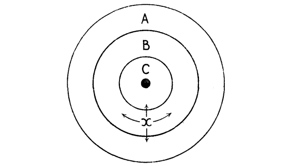

> 本文译自 R. H. Coase 的论文 "The Nature of the Firm"，原载 *Economica*, New Series, Vol. 4, No. 16 (November 1937), pp. 386–405。  
> 作者：R. H. Coase（罗纳德·哈里·科斯）  
> 英文原文依据上传的 PDF 版式重新录入并作了少量排印订正；中文为逐段对照翻译。  
> 脚注在原刊中位于页脚，此处按出现顺序编号，集中放在每一节正文之后（编号在每一节内重新起算）。

# The Nature of the Firm 企业的性质

By R. H. COASE

## 原文正文

ECONOMIC theory has suffered in the past from a failure to state clearly its assumptions. Economists in building up a theory have often omitted to examine the foundations on which it was erected. This examination is, however, essential not only to prevent the misunderstanding and needless controversy which arise from a lack of knowledge of the assumptions on which a theory is based, but also because of the extreme importance for economics of good judgment in choosing between rival sets of assumptions. For instance, it is suggested that the use of the word "firm" in economics may be different from the use of the term by the "plain man." Since there is apparently a trend in economic theory towards starting analysis with the individual firm and not with the industry, it is all the more necessary not only that a clear definition of the word "firm" should be given but that its difference from a firm in the "real world," if it exists, should be made clear. Mrs. Robinson has said that "the two questions to be asked of a set of assumptions in economics are: Are they tractable? and: Do they correspond with the real world?" Though, as Mrs. Robinson points out, "more often one set will be manageable and the other realistic," yet there may well be branches of theory where assumptions may be both manageable and realistic. It is hoped to show in the following paper that a definition of a firm may be obtained which is not only realistic in that it corresponds to what is meant by a firm in the real world, but is tractable by two of the most powerful instruments of economic analysis developed by Marshall, the idea of the margin and that of substitution, together giving the idea of substitution at the margin. Our definition must, of course, "relate to formal relations which are capable of being conceived exactly."

过去，经济理论一直因未能清楚地说明其假设而备受困扰。经济学家在构建理论时，常常忽略了对理论赖以建立的基础进行考察。然而，这种考察不仅必不可少——它可以防止因不了解理论所依据的假设而产生的误解与无谓争论——而且因为对于经济学而言，在相互竞争的假设集合之间作出良好判断具有极端的重要性。例如，有人提出，经济学中"企业"（firm）一词的用法，可能不同于"普通人"对这一术语的用法。既然经济理论显然存在一种从个体企业而非产业出发开始分析的趋向，那么就更加有必要不仅给出"企业"一词的明确定义，而且要说明它与"现实世界"中的企业之间的差别（如果这种差别存在的话）。罗宾逊夫人曾说："对经济学中的一组假设要问的两个问题是：它们是否易于处理？以及：它们是否与现实世界相符？"尽管正如罗宾逊夫人所指出的，"更常见的情形是一组假设易于处理，而另一组贴近现实"，但在某些理论分支中，假设完全可能既易于处理又贴近现实。本文希望表明，我们能够得到一个关于企业的定义：它既贴近现实——与人们在现实世界中所指的企业相吻合——又易于处理，可以用马歇尔所发展出的两个最强有力的经济学分析工具来处理，即边际的概念与替代的概念，二者合起来便给出"边际上的替代"这一观念。当然，我们的定义必须"关涉那些能够被精确设想的正式关系"。

> 1. Joan Robinson, *Economics is a Serious Subject*, p. 12.
> 2. See N. Kaldor, "The Equilibrium of the Firm," *Economic Journal*, March, 1934.
> 3. Op. cit., p. 6.
> 4. J. M. Keynes, *Essays in Biography*, pp. 223–4.
> 5. L. Robbins, *Nature and Significance of Economic Science*, p. 63.

## I

It is convenient if, in searching for a definition of a firm, we first consider the economic system as it is normally treated by the economist. Let us consider the description of the economic system given by Sir Arthur Salter. "The normal economic system works itself. For its current operation it is under no central control, it needs no central survey. Over the whole range of human activity and human need, supply is adjusted to demand, and production to consumption, by a process that is automatic, elastic and responsive." An economist thinks of the economic system as being co-ordinated by the price mechanism and society becomes not an organisation but an organism. The economic system "works itself." This does not mean that there is no planning by individuals. These exercise foresight and choose between alternatives. This is necessarily so if there is to be order in the system. But this theory assumes that the direction of resources is dependent directly on the price mechanism. Indeed, it is often considered to be an objection to economic planning that it merely tries to do what is already done by the price mechanism. Sir Arthur Salter's description, however, gives a very incomplete picture of our economic system.

在寻找企业定义的过程中，如果我们先考察经济学家通常所处理的经济体系，会更为方便。让我们看看阿瑟·索尔特爵士对经济体系的描述："正常的经济体系自行运转。就它的日常运行而言，它不受任何中央控制，也不需要中央的统筹安排。在人类活动与人类需要的整个范围内，供给适应需求、生产适应消费，靠的是一个自动、富有弹性且反应灵敏的过程。"经济学家把经济体系看作由价格机制加以协调，于是社会就不是一个组织，而是一个有机体。经济体系"自行运转"。这并不意味着个人不做任何计划。个人会运用预见，并在各种备选方案之间作出选择。若体系要有秩序，这必然是必需的。但这一理论假定，资源的流向直接取决于价格机制。事实上，人们常常把这一点当作反对经济计划的理由：经济计划不过是在试图做价格机制已经在做的事情。然而，阿瑟·索尔特爵士的描述对我们的经济体系给出的图景是非常不完整的。

Within a firm, the description does not fit at all. For instance, in economic theory we find that the allocation of factors of production between different uses is determined by the price mechanism. The price of factor A becomes higher in X than in Y. As a result, A moves from Y to X until the difference between the prices in X and Y, except in so far as it compensates for other differential advantages, disappears. Yet in the real world, we find that there are many areas where this does not apply. If a workman moves from department Y to department X, he does not go because of a change in relative prices, but because he is ordered to do so. Those who object to economic planning on the grounds that the problem is solved by price movements can be answered by pointing out that there is planning within our economic system which is quite different from the individual planning mentioned above and which is akin to what is normally called economic planning. The example given above is typical of a large sphere in our modern economic system.

在企业内部，这一描述完全不合用。例如，在经济理论中我们发现，生产要素在不同用途之间的配置由价格机制决定。要素 A 的价格在 X 处变得高于 Y 处。于是 A 从 Y 移向 X，直到 X 与 Y 之间的价格差消失为止——除非这一差价是用来补偿其他方面的差异优势的。然而在现实世界中，我们发现有许多领域并不适用这一说法。如果一个工人从 Y 部门调到 X 部门，他并不是因为相对价格发生了变化才去的，而是因为有人命令他去。那些以"问题已由价格变动解决"为由反对经济计划的人，可以这样来回答：在我们的经济体系内部存在着计划，它与上面提到的个人计划完全不同，而与通常所谓的"经济计划"颇为相似。上面所举的例子，在我们现代经济体系中是一个很大领域里的典型情形。

Of course, this fact has not been ignored by economists. Marshall introduces organisation as a fourth factor of production; J. B. Clark gives the co-ordinating function to the entrepreneur; Professor Knight introduces managers who co-ordinate. As D. H. Robertson points out, we find "islands of conscious power in this ocean of unconscious co-operation like lumps of butter coagulating in a pail of buttermilk." But in view of the fact that it is usually argued that co-ordination will be done by the price mechanism, why is such organisation necessary? Why are there these "islands of conscious power"? Outside the firm, price movements direct production, which is co-ordinated through a series of exchange transactions on the market. Within a firm, these market transactions are eliminated and in place of the complicated market structure with exchange transactions is substituted the entrepreneur-co-ordinator, who directs production. It is clear that these are alternative methods of co-ordinating production. Yet, having regard to the fact that if production is regulated by price movements, production could be carried on without any organisation at all, well might we ask, why is there any organisation?

当然，经济学家并没有忽视这一事实。马歇尔把组织列为第四种生产要素；J. B. 克拉克把协调职能赋予企业家；奈特教授引入了进行协调的管理者。正如 D. H. 罗伯逊所指出的，我们发现"在这片无意识合作的海洋中，存在着若干有意识权力的岛屿，就像一桶酪乳中凝结出的一块块黄油"。但既然通常的论点是协调将由价格机制完成，为什么这种组织是必要的？为什么会有这些"有意识权力的岛屿"？在企业外部，价格变动引导生产，生产通过市场上的一系列交换交易得到协调。在企业内部，这些市场交易被取消，替代含有交换交易的复杂市场结构的是指挥生产的企业家—协调者。显然，这是协调生产的两种不同方法。然而，考虑到如果生产由价格变动来调节，生产原本可以在完全没有任何组织的情况下进行，我们完全可以追问：为什么还会存在任何组织？

> 1. This description is quoted with approval by D. H. Robertson, *Control of Industry*, p. 85, and by Professor Arnold Plant, "Trends in Business Administration," *ECONOMICA*, February, 1932. It appears in *Allied Shipping Control*, pp. 16–17.
> 2. See F. A. Hayek, "The Trend of Economic Thinking," *ECONOMICA*, May, 1933; and F. A. Hayek, op. cit.
> 3. Op. cit., p. 85.
> 4. In the rest of this paper I shall use the term entrepreneur to refer to the person or persons who, in a competitive system, take the place of the price mechanism in the direction of resources.
> 5. *Survey of Textile Industries*, p. 26.

Of course, the degree to which the price mechanism is superseded varies greatly. In a department store, the allocation of the different sections to the various locations in the building may be done by the controlling authority or it may be the result of competitive price bidding for space. In the Lancashire cotton industry, a weaver can rent power and shop-room and can obtain looms and yarn on credit. This co-ordination of the various factors of production is, however, normally carried out without the intervention of the price mechanism. As is evident, the amount of "vertical" integration, involving as it does the supersession of the price mechanism, varies greatly from industry to industry and from firm to firm.

当然，价格机制被取代的程度差异极大。在一家百货商店里，把不同部门分配到楼内各个位置，可能由管理当局决定，也可能是对场地竞价的结果。在兰开夏郡的棉纺织业中，织工可以租用动力和厂房，并可赊购织机和棉纱。然而，各种生产要素的这种协调通常是在价格机制不介入的情况下完成的。显而易见，"纵向"一体化的程度——它本身就意味着价格机制被取代——在产业之间和企业之间差别很大。

It can, I think, be assumed that the distinguishing mark of the firm is the supersession of the price mechanism. It is, of course, as Professor Robbins points out, "related to an outside network of relative prices and costs," but it is important to discover the exact nature of this relationship. This distinction between the allocation of resources in a firm and the allocation in the economic system has been very vividly described by Mr. Maurice Dobb when discussing Adam Smith's conception of the capitalist: "It began to be seen that there was something more important than the relations inside each factory or unit captained by an undertaker; there were the relations of the undertaker with the rest of the economic world outside his immediate sphere . . . . the undertaker busies himself with the division of labour inside each firm and he plans and organises consciously," but "he is related to the much larger economic specialisation, of which he himself is merely one specialised unit. Here, he plays his part as a single cell in a larger organism, mainly unconscious of the wider rôle he fills."

我认为可以这样假定：企业的显著标志就是对价格机制的取代。当然，正如罗宾斯教授所指出的，它与"外部的相对价格与成本网络"相关联，但弄清这种关系的准确性质十分重要。莫里斯·多布先生在讨论亚当·斯密的资本家概念时，非常生动地描述了企业内部资源配置与经济体系内资源配置之间的这一区别："人们开始看到，还有比每个由企业主（undertaker）统领的工厂或单位内部的关系更为重要的东西；那就是企业主与其直接活动范围之外的其余经济世界之间的关系……企业主忙于每个企业内部的劳动分工，他有意识地进行计划和安排"，但"他与那种大得多的经济专业化体系相关联，而他自己不过是其中一个专业化的单位而已。在这里，他作为一个更大有机体中的单个细胞发挥着自己的作用，对于自己所承担的更宽广的角色基本上是无意识的。"

> 1. Op. cit., p. 71.
> 2. *Capitalist Enterprise and Social Progress*, p. 20. Cf., also, Henderson, *Supply and Demand*, pp. 3–5.

In view of the fact that while economists treat the price mechanism as a co-ordinating instrument, they also admit the co-ordinating function of the "entrepreneur," it is surely important to enquire why co-ordination is the work of the price mechanism in one case and of the entrepreneur in another. The purpose of this paper is to bridge what appears to be a gap in economic theory between the assumption (made for some purposes) that resources are allocated by means of the price mechanism and the assumption (made for other purposes) that this allocation is dependent on the entrepreneur-co-ordinator. We have to explain the basis on which, in practice, this choice between alternatives is effected.

既然经济学家一方面把价格机制视为一种协调工具，另一方面又承认"企业家"的协调职能，那么探究下述问题无疑是重要的：为什么在一种情形下协调是价格机制的工作，而在另一种情形下却是企业家的工作。本文的目的，是在经济理论中弥合一道看似存在的鸿沟：一边是（出于某些目的而作出的）假设——资源通过价格机制得到配置；另一边是（出于另一些目的而作出的）假设——这种配置取决于企业家—协调者。我们必须解释：在实践中，这种在备选方案之间的选择究竟依据什么而作出。

> 1. It is easy to see when the State takes over the direction of an industry that, in planning it, it is doing something which was previously done by the price mechanism. What is usually not realised is that any business man in organising the relations between his departments is also doing something which could be organised through the price mechanism. There is therefore point in Mr. Durbin's answer to those who emphasise the problems involved in economic planning that the same problems have to be solved by business men in the competitive system. (See "Economic Calculus in a Planned Economy," *Economic Journal*, December, 1936.) The important difference between these two cases is that economic planning is imposed on industry while firms arise voluntarily because they represent a more efficient method of organising production. In a competitive system, there is an "optimum" amount of planning!

## II

Our task is to attempt to discover why a firm emerges at all in a specialised exchange economy. The price mechanism (considered purely from the side of the direction of resources) might be superseded if the relationship which replaced it was desired for its own sake. This would be the case, for example, if some people preferred to work under the direction of some other person. Such individuals would accept less in order to work under someone, and firms would arise naturally from this. But it would appear that this cannot be a very important reason, for it would rather seem that the opposite tendency is operating if one judges from the stress normally laid on the advantage of "being one's own master." Of course, if the desire was not to be controlled but to control, to exercise power over others, then people might be willing to give up something in order to direct others; that is, they would be willing to pay others more than they could get under the price mechanism in order to be able to direct them. But this implies that those who direct pay in order to be able to do this and are not paid to direct, which is clearly not true in the majority of cases. Firms might also exist if purchasers preferred commodities which are produced by firms to those not so produced; but even in spheres where one would expect such preferences (if they exist) to be of negligible importance, firms are to be found in the real world. Therefore there must be other elements involved.

我们的任务是试图弄清：在一个专业化的交换经济中，企业究竟为什么会存在。价格机制（仅从资源流向这一侧来考虑）之所以可能被取代，或许是因为取代它的那种关系本身就是人们所想要的。例如，如果有些人宁愿在别人的指挥下工作，情形便会如此。这些人为了能在他人手下工作而愿意接受较少的报酬，企业便会由此自然产生。但看来这不可能是一个很重要的原因，因为从人们通常对"自己做自己的主人"这一好处的强调来判断，起作用的倒更像是相反的倾向。当然，如果人们的欲望不是被控制而是去控制、去对他人行使权力，那么人们就可能为了指挥他人而愿意放弃一些东西；也就是说，他们愿意付给他人比其在价格机制下所能得到的更多的报酬，以便能够指挥他们。但这意味着那些指挥者是付钱来换取指挥权的，而不是因指挥而获得报酬——这在大多数情况下显然不成立。如果购买者偏爱由企业生产的商品，而不喜欢非企业生产的商品，企业也可能存在；但即使在人们预期这种偏好（如果存在的话）无足轻重的领域里，现实世界中也能找到企业。因此，必然还有其他因素在起作用。

The main reason why it is profitable to establish a firm would seem to be that there is a cost of using the price mechanism. The most obvious cost of "organising" production through the price mechanism is that of discovering what the relevant prices are. This cost may be reduced but it will not be eliminated by the emergence of specialists who will sell this information. The costs of negotiating and concluding a separate contract for each exchange transaction which takes place on a market must also be taken into account. Again, in certain markets, e.g., produce exchanges, a technique is devised for minimising these contract costs; but they are not eliminated. It is true that contracts are not eliminated when there is a firm but they are greatly reduced. A factor of production (or the owner thereof) does not have to make a series of contracts with the factors with whom he is co-operating within the firm, as would be necessary, of course, if this co-operation were as a direct result of the working of the price mechanism. For this series of contracts is substituted one.

建立企业之所以有利可图，主要原因似乎在于：使用价格机制是有成本的。通过价格机制"组织"生产的最显而易见的成本，就是弄清相关价格是什么的成本。这种成本可能因那些出售此类信息的专家的出现而降低，但不会被消除。此外，还必须考虑到在市场上进行的每一笔交换交易，为谈判和订立一份单独契约所付出的成本。同样，在某些市场上——例如农产品交易所——人们设计出某种技术来把这些契约成本降到最低，但它们并未被消除。确实，当存在企业时，契约并没有被取消，而是被大大减少了。一种生产要素（或其所有者）不必与在企业内部和他协作的那些要素订立一系列契约——而如果这种协作是价格机制运作的直接结果，这一系列契约当然是必需的。这一系列契约被一份契约所取代。

At this stage, it is important to note the character of the contract into which a factor enters that is employed within a firm. The contract is one whereby the factor, for a certain remuneration (which may be fixed or fluctuating), agrees to obey the directions of an entrepreneur within certain limits. The essence of the contract is that it should only state the limits to the powers of the entrepreneur. Within these limits, he can therefore direct the other factors of production.

在这一点上，重要的是注意在企业内部被雇用的要素所订立的那份契约的性质。这种契约的内容是：该要素为取得一定的报酬（可以是固定的，也可以是浮动的），同意在一定限度内服从企业家的指挥。契约的本质在于，它只应规定企业家权力的界限。因此，在这些界限之内，他就可以指挥其他生产要素。

There are, however, other disadvantages—or costs—of using the price mechanism. It may be desired to make a long-term contract for the supply of some article or service. This may be due to the fact that if one contract is made for a longer period, instead of several shorter ones, then certain costs of making each contract will be avoided. Or, owing to the risk attitude of the people concerned, they may prefer to make a long rather than a short-term contract. Now, owing to the difficulty of forecasting, the longer the period of the contract is for the supply of the commodity or service, the less possible, and indeed, the less desirable it is for the person purchasing to specify what the other contracting party is expected to do. It may well be a matter of indifference to the person supplying the service or commodity which of several courses of action is taken, but not to the purchaser of that service or commodity. But the purchaser will not know which of these several courses he will want the supplier to take. Therefore, the service which is being provided is expressed in general terms, the exact details being left until a later date. All that is stated in the contract is the limits to what the persons supplying the commodity or service is expected to do. The details of what the supplier is expected to do is not stated in the contract but is decided later by the purchaser. When the direction of resources (within the limits of the contract) becomes dependent on the buyer in this way, that relationship which I term a "firm" may be obtained.

然而，使用价格机制还有其他不利之处——或者说成本。人们可能希望就某种物品或服务的供应订立一份长期契约。这可能是因为：如果订立一份期限较长的契约，而不是若干份期限较短的契约，就可以避免订立每份契约的某些成本。或者，由于相关当事人的风险态度，他们可能宁愿订立长期契约而非短期契约。现在，由于预测上的困难，物品或服务的供应契约期限越长，购买方就越不可能、也确实越不适宜明确规定缔约的另一方应当做什么。对于提供该服务或物品的人来说，在若干种行动方案中采取哪一种，他可能完全无所谓；但对购买该服务或物品的人来说却并非如此。可是购买者并不知道，在若干种方案中他会希望供应方采取哪一种。因此，所供应的服务只用一般性的措辞来表述，确切的细节则留待日后决定。契约中规定的，只是提供物品或服务的人被期望去做什么的界限。供应方被期望做什么的具体细节并不写进契约，而是由购买方在事后决定。当资源的流向（在契约的界限之内）以这种方式取决于购买方时，我所称的"企业"这种关系就可能出现了。

A firm is likely therefore to emerge in those cases where a very short term contract would be unsatisfactory. It is obviously of more importance in the case of services—labour—than it is in the case of the buying of commodities. In the case of commodities, the main items can be stated in advance and the details which will be decided later will be of minor significance.

因此，在那些极短期契约无法令人满意的情形中，企业便很可能出现。这一点在服务——劳动——的场合显然比在购买商品的场合更为重要。就商品而言，主要条款可以事先讲明，日后才决定的细节只具有次要意义。

We may sum up this section of the argument by saying that the operation of a market costs something and by forming an organisation and allowing some authority (an "entrepreneur") to direct the resources, certain marketing costs are saved. The entrepreneur has to carry out his function at less cost, taking into account the fact that he may get factors of production at a lower price than the market transactions which he supersedes, because it is always possible to revert to the open market if he fails to do this.

我们可以把这一部分的论证总结如下：市场的运行是有成本的，而通过形成一个组织并让某种权威（一位"企业家"）来指挥资源，就可以节省某些市场成本。企业家必须以更低的成本履行其职能，同时还要考虑到他可能以低于他所取代的那些市场交易的价格获得生产要素——因为如果他做不到这一点，随时都可以回到公开市场上去。

The question of uncertainty is one which is often considered to be very relevant to the study of the equilibrium of the firm. It seems improbable that a firm would emerge without the existence of uncertainty. But those, for instance, Professor Knight, who make the mode of payment the distinguishing mark of the firm—fixed incomes being guaranteed to some of those engaged in production by a person who takes the residual, and fluctuating, income—would appear to be introducing a point which is irrelevant to the problem we are considering. One entrepreneur may sell his services to another for a certain sum of money, while the payment to his employees may be mainly or wholly a share in profits. The significant question would appear to be why the allocation of resources is not done directly by the price mechanism.

不确定性问题，常常被认为与企业均衡的研究极为相关。很难想象企业会在不存在不确定性的情况下出现。但是，像奈特教授那样把支付方式当作企业的显著标志的人——即由某个取得剩余的、波动的收入的人，向从事生产的某些人保证固定的收入——看来是在引入一个与我们正在考虑的问题无关的论点。一位企业家可能为了一笔确定的金额而把其服务出售给另一位企业家，而他对雇员的支付却可能主要是或完全是利润分成。真正重要的问题似乎是：为什么资源的配置不是直接由价格机制完成的。

Another factor that should be noted is that exchange transactions on a market and the same transactions organised within a firm are often treated differently by Governments or other bodies with regulatory powers. If we consider the operation of a sales tax, it is clear that it is a tax on market transactions and not on the same transactions organised within the firm. Now since these are alternative methods of "organisation"—by the price mechanism or by the entrepreneur—such a regulation would bring into existence firms which otherwise would have no raison d'être. It would furnish a reason for the emergence of a firm in a specialised exchange economy. Of course, to the extent that firms already exist, such a measure as a sales tax would merely tend to make them larger than they would otherwise be. Similarly, quota schemes, and methods of price control which imply that there is rationing, and which do not apply to firms producing such products for themselves, by allowing advantages to those who organise within the firm and not through the market, necessarily encourage the growth of firms. But it is difficult to believe that it is measures such as have been mentioned in this paragraph which have brought firms into existence. Such measures would, however, tend to have this result if they did not exist for other reasons.

还应当注意另一个因素：市场上的交换交易与企业内部组织的同样的交易，往往被政府或其他拥有管制权力的机构区别对待。如果考察销售税的运作，显然它是对市场交易征税，而不对企业内部组织的同样交易征税。既然这两者是"组织"的两种备选方法——通过价格机制或通过企业家——那么这样的管制就会造就出那些本来没有存在理由的企业。它会在一个专业化的交换经济中为企业出现提供一种理由。当然，就企业已经存在而言，销售税这类措施只会使它们比原本的规模更大。同样，配额方案以及意味着配给的、不适用于自产自用企业的价格管制方法，由于给了那些在企业内部而非通过市场进行组织的人以优势，必然会鼓励企业成长。但很难相信，正是本段提到的这类措施使企业得以产生。不过，如果这些措施不是出于其他原因而存在，它们倒确实会倾向于产生这样的结果。

These, then, are the reasons why organisations such as firms exist in a specialised exchange economy in which it is generally assumed that the distribution of resources is "organised" by the price mechanism. A firm, therefore, consists of the system of relationships which comes into existence when the direction of resources is dependent on an entrepreneur.

以上这些，就是在一个通常假定资源配置由价格机制"组织"的专业化交换经济中，像企业这样的组织之所以存在的原因。因此，企业由这样一种关系体系构成：当资源的流向取决于一位企业家时，这种关系体系便产生了。

> 1. Cf. Harry Dawes, "Labour Mobility in the Steel Industry," *Economic Journal*, March, 1934, who instances "the trek to retail shopkeeping and insurance work by the better paid of skilled men due to the desire (often the main aim in life of a worker) to be independent" (p. 86).
> 2. None the less, this is not altogether fanciful. Some small shopkeepers are said to earn less than their assistants.
> 3. G. F. Shove, "The Imperfection of the Market: a Further Note," *Economic Journal*, March, 1933, p. 116, note 1, points out that such preferences may exist, although the example he gives is almost the reverse of the instance given in the text.
> 4. According to N. Kaldor, "A Classificatory Note of the Determinateness of Equilibrium," *Review of Economic Studies*, February, 1934, it is one of the assumptions of static theory that "All the relevant prices are known to all individuals." But this is clearly not true of the real world.
> 5. This influence was noted by Professor Usher when discussing the development of capitalism. He says: "The successive buying and selling of partly finished products were sheer waste of energy." (*Introduction to the Industrial History of England*, p. 13). But he does not develop the idea nor consider why it is that buying and selling operations still exist.
> 6. It would be possible for no limits to the powers of the entrepreneur to be fixed. This would be voluntary slavery. According to Professor Batt, *The Law of Master and Servant*, p. 18, such a contract would be void and unenforceable.
> 7. Of course, it is not possible to draw a hard and fast line which determines whether there is a firm or not. There may be more or less direction. It is similar to the legal question of whether there is the relationship of master and servant or principal and agent. See the discussion of this problem below.
> 8. The views of Professor Knight are examined below in more detail.

The approach which has just been sketched would appear to offer an advantage in that it is possible to give a scientific meaning to what is meant by saying that a firm gets larger or smaller. A firm becomes larger as additional transactions (which could be exchange transactions co-ordinated through the price mechanism) are organised by the entrepreneur and becomes smaller as he abandons the organisation of such transactions. The question which arises is whether it is possible to study the forces which determine the size of the firm. Why does the entrepreneur not organise one less transaction or one more? It is interesting to note that Professor Knight considers that:

刚刚勾画的这一思路似乎有一个优点：它能够为"企业变大或变小"这一说法给出科学上的含义。当企业家组织了更多的交易（这些交易原本可以是通过价格机制协调的交换交易）时，企业就变大；当他放弃组织这类交易时，企业就变小。由此产生的问题是：是否有可能研究决定企业规模的各种力量？为什么企业家不会少组织一笔交易，或者多组织一笔交易？值得注意的是，奈特教授认为：

> "the relation between efficiency and size is one of the most serious problems of theory, being, in contrast with the relation for a plant, largely a matter of personality and historical accident rather than of intelligible general principles. But the question is peculiarly vital because the possibility of monopoly gain offers a powerful incentive to continuous and unlimited expansion of the firm, which force must be offset by some equally powerful one making for decreased efficiency (in the production of money income) with growth in size, if even boundary competition is to exist."

> "效率与规模之间的关系是理论中最严峻的问题之一；与工厂的情形不同，它在很大程度上取决于个人特质和历史偶然，而不是可以理解的一般原则。但这个问题格外关键，因为垄断收益的可能性为企业持续而无限制的扩张提供了强有力的激励；如果连边缘竞争都要存在，这种力量就必须被某种同样强大的力量所抵消——后者随规模增长而导致（货币收入生产上的）效率下降。"

Professor Knight would appear to consider that it is impossible to treat scientifically the determinants of the size of the firm. On the basis of the concept of the firm developed above, this task will now be attempted.

奈特教授似乎认为，不可能对企业规模的决定因素作科学研究。基于上文所发展的企业概念，现在就来尝试这项任务。

It was suggested that the introduction of the firm was due primarily to the existence of marketing costs. A pertinent question to ask would appear to be (quite apart from the monopoly considerations raised by Professor Knight), why, if by organising one can eliminate certain costs and in fact reduce the cost of production, are there any market transactions at all? Why is not all production carried on by one big firm? There would appear to be certain possible explanations.

前面提出，企业的引入主要归因于市场成本的存在。那么一个切题的问题似乎是（且完全撇开奈特教授提出的垄断方面的考虑不谈）：如果通过组织就可以消除某些成本、并且事实上降低生产成本，那为什么还会存在任何市场交易？为什么不是全部生产都由一家大企业来进行呢？看来有若干可能的解释。

First, as a firm gets larger, there may be decreasing returns to the entrepreneur function, that is, the costs of organising additional transactions within the firm may rise. Naturally, a point must be reached where the costs of organising an extra transaction within the firm are equal to the costs involved in carrying out the transaction in the open market, or, to the costs of organising by another entrepreneur. Secondly, it may be that as the transactions which are organised increase, the entrepreneur fails to place the factors of production in the uses where their value is greatest, that is, fails to make the best use of the factors of production. Again, a point must be reached where the loss through the waste of resources is equal to the marketing costs of the exchange transaction in the open market or to the loss if the transaction was organised by another entrepreneur. Finally, the supply price of one or more of the factors of production may rise, because the "other advantages" of a small firm are greater than those of a large firm. Of course, the actual point where the expansion of the firm ceases might be determined by a combination of the factors mentioned above. The first two reasons given most probably correspond to the economists' phrase of "diminishing returns to management."

第一，随着企业变大，企业家职能可能出现报酬递减，也就是说，在企业内部组织追加交易的成本可能上升。自然地，必然会有某一点，在这一点上，企业内部组织一笔额外交易的成本等于在公开市场上完成这笔交易的成本，或等于由另一位企业家来组织的成本。第二，可能随着被组织的交易增多，企业家未能把生产要素置于其价值最大的用途上，也就是说，未能最好地利用生产要素。同样，必然会有某一点，在这一点上，资源浪费所造成的损失等于公开市场上该交换交易的市场成本，或等于该交易由另一位企业家组织时的损失。最后，一种或多种生产要素的供给价格可能上升，因为小企业的"其他优势"大于大企业。当然，企业扩张实际停止的那一点，可能是由上述各因素的组合决定的。所列的前两个原因，很可能就对应于经济学家所说的"管理上的报酬递减"。

> 1. *Risk, Uncertainty and Profit*, Preface to the Re-issue, London School of Economics Series of Reprints, No. 16, 1933.
> 2. There are certain marketing costs which could only be eliminated by the abolition of "consumers' choice" and these are the costs of retailing. It is conceivable that these costs might be so high that people would be willing to accept rations because the extra product obtained was worth the loss of their choice.
> 3. This argument assumes that exchange transactions on a market can be considered as homogeneous; this complication is taken into account below. It is clearly untrue in fact.
> 4. For a discussion of the variation of the supply price of factors of production to firms of varying size, see E. A. G. Robinson, *The Structure of Competitive Industry*. It is sometimes said that the supply price of organising ability increases as the size of the firm increases because men prefer to be the heads of small independent businesses rather than the heads of departments in a large business. See Jones, *The Trust Problem*, p. 531, and Macgregor, *Industrial Combination*, p. 63. This is a common argument of those who advocate Rationalisation. It is said that larger units would be more efficient, but owing to the individualistic spirit of the smaller entrepreneurs, they prefer to remain independent, apparently in spite of the higher income which their increased efficiency under Rationalisation makes possible. For a more thorough discussion of this particular problem, see N. Kaldor, "The Equilibrium of the Firm," *Economic Journal*, March, 1934, and E. A. G. Robinson, "The Problem of Management and the Size of the Firm," *Economic Journal*, June, 1934.
> 5. This discussion is, of course, brief and incomplete.
> 6. A definition of this term is given below.

The point has been made in the previous paragraph that a firm will tend to expand until the costs of organising an extra transaction within the firm become equal to the costs of carrying out the same transaction by means of an exchange on the open market or the costs of organising in another firm. But if the firm stops its expansion at a point below the costs of marketing in the open market and at a point equal to the costs of organising in another firm, in most cases (excluding the case of "combination"), this will imply that there is a market transaction between these two producers, each of whom could organise it at less than the actual marketing costs. How is the paradox to be resolved? If we consider an example the reason for this will become clear. Suppose A is buying a product from B and that both A and B could organise this marketing transaction at less than its present cost. B, we can assume, is not organising one process or stage of production, but several. If A therefore wishes to avoid a market transaction, he will have to take over all the processes of production controlled by B. Unless A takes over all the processes of production, a market transaction will still remain, although it is a different product that is bought. But we have previously assumed that as each producer expands he becomes less efficient; the additional costs of organising extra transactions increase. It is probable that A's cost of organising the transactions previously organised by B will be greater than B's cost of doing the same thing. A therefore will take over the whole of B's organisation only if his cost of organising B's work is not greater than B's cost by an amount equal to the costs of carrying out an exchange transaction on the open market. But once it becomes economical to have a market transaction, it also pays to divide production in such a way that the cost of organising an extra transaction in each firm is the same.

上一段已经指出，企业会倾向于扩张，直到在企业内部组织一笔追加交易的成本等于通过公开市场交换来完成同一笔交易的成本，或等于在另一家企业中组织的成本。但是，如果企业在低于公开市场交易成本的那一点、同时又等于在另一家企业中组织的成本的那一点上停止扩张，那么在大多数情况下（"结合"的情形除外），这就意味着这两个生产者之间存在一笔市场交易，而他们中的任何一方原本都能以低于实际市场成本的成本来组织它。这一悖论如何解决？如果我们考虑一个例子，原因就会变得清楚。假设 A 向 B 购买一种产品，而 A 和 B 都能以低于目前成本的成本来组织这笔市场交易。我们可以假定，B 组织的不是一个生产过程或阶段，而是若干个。因此，如果 A 想要避免一笔市场交易，他就必须接管由 B 控制的全部生产过程。除非 A 接管全部生产过程，否则仍会留下一笔市场交易，只不过所购买的是另一种产品了。但我们此前已假定，每个生产者随着扩张都会变得效率更低；组织追加交易的额外成本会上升。很可能，A 组织原先由 B 组织的那些交易的成本，会高于 B 做同样事情的成本。因此，只有当 A 组织 B 那部分工作的成本不比 B 的成本高出相当于在公开市场上完成一笔交换交易的成本时，A 才会接管 B 的全部组织。然而，一旦存在市场交易变得合算，那么以使得每家企业组织一笔追加交易的成本相同的方式来划分生产，也就同样合算。

Up to now it has been assumed that the exchange transactions which take place through the price mechanism are homogeneous. In fact, nothing could be more diverse than the actual transactions which take place in our modern world. This would seem to imply that the costs of carrying out exchange transactions through the price mechanism will vary considerably as will also the costs of organising these transactions within the firm. It seems therefore possible that quite apart from the question of diminishing returns the costs of organising certain transactions within the firm may be greater than the costs of carrying out the exchange transactions in the open market. This would necessarily imply that there were exchange transactions carried out through the price mechanism, but would it mean that there would have to be more than one firm? Clearly not, for all those areas in the economic system where the direction of resources was not dependent directly on the price mechanism could be organised within one firm. The factors which were discussed earlier would seem to be the important ones, though it is difficult to say whether "diminishing returns to management" or the rising supply price of factors is likely to be the more important.

到此为止，一直假定通过价格机制进行的交换交易是同质的。事实上，在我们现代世界中实际发生的交易，再没有比这更千差万别的了。这似乎意味着，通过价格机制完成交换交易的成本会差异很大，而在企业内部组织这些交易的成本同样也会差异很大。因此，似乎可能出现这样的情况：完全撇开报酬递减问题不谈，在企业内部组织某些交易的成本也可能高于在公开市场上完成交换交易的成本。这必然意味着有些交换交易是通过价格机制来完成的——但这是否意味着必须存在一个以上的企业呢？显然不是，因为经济体系中所有那些资源流向不直接取决于价格机制的领域，都可以在一个企业内组织起来。前面讨论过的那些因素看来是重要的因素，尽管很难说"管理上的报酬递减"与生产要素供给价格的上升哪一个更可能更重要。

Other things being equal, therefore, a firm will tend to be larger:

在其他条件相同的情况下，因此，企业倾向于越大：

> (a) the less the costs of organising and the slower these costs rise with an increase in the transactions organised.
> (b) the less likely the entrepreneur is to make mistakes and the smaller the increase in mistakes with an increase in the transactions organised.
> (c) the greater the lowering (or the less the rise) in the supply price of factors of production to firms of larger size.

> （a）组织成本越低，且这些成本随所组织交易的增加而上升得越慢；
> （b）企业家越不可能犯错误，且错误随所组织交易的增加而增加得越少；
> （c）规模较大的企业，其生产要素供给价格被压得越低（或上升得越少）。

Apart from variations in the supply price of factors of production to firms of different sizes, it would appear that the costs of organising and the losses through mistakes will increase with an increase in the spatial distribution of the transactions organised, in the dissimilarity of the transactions, and in the probability of changes in the relevant prices. As more transactions are organised by an entrepreneur, it would appear that the transactions would tend to be either different in kind or in different places. This furnishes an additional reason why efficiency will tend to decrease as the firm gets larger. Inventions which tend to bring factors of production nearer together, by lessening spatial distribution, tend to increase the size of the firm. Changes like the telephone and the telegraph which tend to reduce the cost of organising spatially will tend to increase the size of the firm. All changes which improve managerial technique will tend to increase the size of the firm.

除了不同规模企业所面对的生产要素供给价格的差异之外，看来组织成本以及因错误而造成的损失，会随着所组织交易的空间分布、交易的差异性以及相关价格变动概率的增加而增加。随着企业家组织更多的交易，这些交易似乎会倾向于在种类上或在地点上有所不同。这就为企业越大效率越倾向于下降提供了又一个理由。倾向于把生产要素在空间上拉近、从而减少空间分布的发明，会倾向于增大企业规模。像电话和电报这类倾向于降低空间组织成本的变化，会倾向于增大企业规模。一切改进管理技术的变革，都会倾向于增大企业规模。

> 1. This aspect of the problem is emphasised by N. Kaldor, op. cit. Its importance in this connection had been previously noted by E. A. G. Robinson, *The Structure of Competitive Industry*, pp. 83–106. This assumes that an increase in the probability of price movements increases the costs of organising within a firm more than it increases the cost of carrying out an exchange transaction on the market—which is probable.
> 2. This would appear to be the importance of the treatment of the technical unit by E. A. G. Robinson, op. cit., pp. 27–33. The larger the technical unit, the greater the concentration of factors and therefore the firm is likely to be larger.
> 3. It should be noted that most inventions will change both the costs of organising and the costs of using the price mechanism. In such cases, whether the invention tends to make firms larger or smaller will depend on the relative effect on these two sets of costs. For instance, if the telephone reduces the costs of using the price mechanism more than it reduces the costs of organising, then it will have the effect of reducing the size of the firm.
> 4. An illustration of these dynamic forces is furnished by Maurice Dobb, *Russian Economic Development*, p. 68. "With the passing of bonded labour the factory, as an establishment where work was organised under the whip of the overseer, lost its raison d'être until this was restored to it with the introduction of power machinery after 1846." It seems important to realise that the passage from the domestic system to the factory system is not a mere historical accident, but is conditioned by economic forces. This is shown by the fact that it is possible to move from the factory system to the domestic system, as in the Russian example, as well as the reverse. It is the essence of serfdom that the price mechanism is not allowed to operate. Therefore, there has to be direction from some organiser. When, however, serfdom passed, the price mechanism was allowed to operate. It was not until machinery drew workers into one locality that it paid to supersede the price mechanism and the firm again emerged.
> 5. This is often called "vertical integration," combination being termed "lateral integration."

It should be noted that the definition of a firm which was given above can be used to give more precise meanings to the terms "combination" and "integration." There is a combination when transactions which were previously organised by two or more entrepreneurs become organised by one. This becomes integration when it involves the organisation of transactions which were previously carried out between the entrepreneurs on a market. A firm can expand in either or both of these two ways. The whole of the "structure of competitive industry" becomes tractable by the ordinary technique of economic analysis.

应当注意，上文给出的企业定义，可以用来为"结合"（combination）和"一体化"（integration）这两个术语给出更精确的含义。当原先由两个或更多企业家组织的交易变为由一个企业家组织时，就是"结合"。当它涉及的是把原先在企业之间通过市场进行的交易拿过来组织时，这便成为"一体化"。企业可以按这两种方式中的任意一种或同时按两种方式扩张。整个"竞争性产业的结构"由此就可以用经济分析的通常技术来处理了。

## III

The problem which has been investigated in the previous section has not been entirely neglected by economists and it is now necessary to consider why the reasons given above for the emergence of a firm in a specialised exchange economy are to be preferred to the other explanations which have been offered.

上一节所考察的问题并没有被经济学家完全忽视，现在有必要考虑：为什么上文给出的、关于企业在专业化交换经济中出现的那些理由，要优于已经提出的其他解释。

It is sometimes said that the reason for the existence of a firm is to be found in the division of labour. This is the view of Professor Usher, a view which has been adopted and expanded by Mr. Maurice Dobb. The firm becomes "the result of an increasing complexity of the division of labour . . . . The growth of this economic differentiation creates the need for some integrating force without which differentiation would collapse into chaos; and it is as the integrating force in a differentiated economy that industrial forms are chiefly significant." The answer to this argument is an obvious one. The "integrating force in a differentiated economy" already exists in the form of the price mechanism. It is perhaps the main achievement of economic science that it has shown that there is no reason to suppose that specialisation must lead to chaos. The reason given by Mr. Maurice Dobb is therefore inadmissible. What has to be explained is why one integrating force (the entrepreneur) should be substituted for another integrating force (the price mechanism).

有时人们说，企业存在的原因可以在劳动分工中找到。这是厄舍教授的观点，这一观点被莫里斯·多布先生采纳并加以发挥。企业成了"劳动分工日益复杂化的结果……这种经济分化的增长，产生了对某种整合力量的需要，没有这种力量，分化就会陷入混乱；而产业形态之所以主要具有意义，正是作为分化经济中的整合力量。"对这一论点的回答是显而易见的。那种"分化经济中的整合力量"早已以价格机制的形式存在。经济科学的主要成就或许就在于它表明：没有理由认为专业化必然导致混乱。因此，莫里斯·多布先生给出的理由是站不住脚的。需要解释的是：为什么一种整合力量（企业家）应当被另一种整合力量（价格机制）所取代。

The most interesting reasons (and probably the most widely accepted) which have been given to explain this fact are those to be found in Professor Knight's *Risk, Uncertainty and Profit*. His views will be examined in some detail.

为解释这一事实而给出的最有趣的（大概也是最广为接受的）理由，见于奈特教授的《风险、不确定性与利润》。下面将较为详细地考察他的观点。

> 1. Op. cit., p. 10. Professor Usher's views are to be found in his *Introduction to the Industrial History of England*, pp. 1–18.
> 2. Cf. J. B. Clark, *Distribution of Wealth*, p. 19, who speaks of the theory of exchange as being the "theory of the organisation of industrial society."

Professor Knight starts with a system in which there is no uncertainty: "acting as individuals under absolute freedom but without collusion men are supposed to have organised economic life with the primary and secondary division of labour, the use of capital, etc., developed to the point familiar in present-day America. The principal fact which calls for the exercise of the imagination is the internal organisation of the productive groups or establishments. With uncertainty entirely absent, every individual being in possession of perfect knowledge of the situation, there would be no occasion for anything of the nature of responsible management or control of productive activity. Even marketing transactions in any realistic sense would not be found. The flow of raw materials and productive services to the consumer would be entirely automatic."

奈特教授从一个不存在不确定性的体系出发："人们被设想为在绝对自由之下、但彼此并无串通地作为个人行动，他们已经组织起经济生活，其第一级和第二级劳动分工、资本的使用等等，都发展到了今日美国所熟悉的那种程度。最需要发挥想象力的主要事实，是生产集团或企业的内部组织。在完全不存在不确定性的情况下，每个人都对所处情境拥有完备知识，那就不需要任何具有责任性质的管理或对生产活动的控制。甚至任何现实意义上的营销交易也不会存在。原材料和生产性服务流向消费者的过程将完全是自动的。"

Professor Knight says that we can imagine this adjustment as being "the result of a long process of experimentation worked out by trial-and-error methods alone," while it is not necessary "to imagine every worker doing exactly the right thing at the right time in a sort of 'pre-established harmony' with the work of others. There might be managers, superintendents, etc., for the purpose of co-ordinating the activities of individuals," though these managers would be performing a purely routine function, "without responsibility of any sort."

奈特教授说，我们可以把这种调节想象为"一个长期实验过程的产物，单靠试错的方法逐步摸索出来"，而不必"去设想每个工人都恰好在恰当的时间做着恰当的事情，与别人的工作处于某种'前定和谐'之中。可能会有经理、主管等等来协调个人的活动"，尽管这些经理履行的只是纯粹例行的职能，"不承担任何责任"。

Professor Knight then continues: "With the introduction of uncertainty—the fact of ignorance and the necessity of acting upon opinion rather than knowledge—into this Eden-like situation, its character is entirely changed . . . . With uncertainty present doing things, the actual execution of activity, becomes in a real sense a secondary part of life; the primary problem or function is deciding what to do and how to do it." This fact of uncertainty brings about the two most important characteristics of social organisation.

奈特教授接着写道："随着不确定性——即无知这一事实，以及必须依据意见而非知识去行动的必要性——被引入这种伊甸园式的情境，它的性质就完全改变了……在存在不确定性的情况下，做事情、即活动的实际执行，在真正意义上变成了生活中次要的部分；首要的问题或职能是决定做什么以及如何做。"这一不确定性的事实，带来了社会组织最重要的两个特征。

"In the first place, goods are produced for a market, on the basis of entirely impersonal prediction of wants, not for the satisfaction of the wants of the producers themselves. The producer takes the responsibility of forecasting the consumers' wants. In the second place, the work of forecasting and at the same time a large part of the technological direction and control of production are still further concentrated upon a very narrow class of the producers, and we meet with a new economic functionary, the entrepreneur. . . . . When uncertainty is present and the task of deciding what to do and how to do it takes the ascendancy over that of execution the internal organisation of the productive groups is no longer a matter of indifference or a mechanical detail. Centralisation of this deciding and controlling function is imperative, a process of 'cephalisation' is inevitable."

"首先，商品是为市场而生产的，依据的是对需求的完全非人格化的预测，而不是为了满足生产者自身的需求。生产者承担起预测消费者需求的责任。其次，预测的工作，以及同时属于生产的技术指导与控制的很大一部分，进一步集中于一个非常狭窄的生产者阶层身上，于是我们遇到了一种新的经济职能人员——企业家。……当不确定性存在、且决定做什么和如何做的任务凌驾于执行之上时，生产集团的内部组织就不再是一件无所谓的事，也不再是一个机械性的细节。这种决策与控制职能的集中化势在必行，一个'头部化'（cephalisation）的过程不可避免。"

The most fundamental change is: "the system under which the confident and venturesome assume the risk or insure the doubtful and timid by guaranteeing to the latter a specified income in return for an assignment of the actual results. . . . With human nature as we know it it would be impracticable or very unusual for one man to guarantee to another a definite result of the latter's actions without being given power to direct his work. And on the other hand the second party would not place himself under the direction of the first without such a guarantee. . . . The result of this manifold specialisation of function is the enterprise and wage system of industry. Its existence in the world is the direct result of the fact of uncertainty."

最根本的变化是："一种制度：自信而敢冒风险的人承担风险，或者为那些心存疑虑、胆怯的人提供保险，向后一类人保证一份确定的收入，以换取对实际结果的支配权。……以我们所知的人性而言，一个人若不被赋予指挥他人工作的权力，却要向他人保证其行为的确定结果，那是不切实际的，或者说是极不寻常的。另一方面，如果没有这样的保证，第二方也不会把自己置于第一方的指挥之下。……这种职能上的多重专业化，其结果是产业中的企业与工资制度。它在世界上的存在，是不确定性这一事实的直接结果。"

These quotations give the essence of Professor Knight's theory. The fact of uncertainty means that people have to forecast future wants. Therefore, you get a special class springing up who direct the activities of others to whom they give guaranteed wages. It acts because good judgment is generally associated with confidence in one's judgment.

这些引文给出了奈特教授理论的要点。不确定性这一事实意味着人们必须预测未来的需求。因此，就产生出一个特殊的阶级，他们指挥他人的活动，并给后者发放有保证的工资。它之所以起作用，是因为良好的判断力通常与对自己判断的信心相伴。

> 1. *Risk, Uncertainty and Profit*, p. 267.
> 2. Op. cit., pp. 267–8.
> 3. Op. cit., p. 268.
> 4. Op. cit., pp. 268–9.
> 5. Op. cit., p. 270.
> 6. Op. cit., pp. 269–70.

Professor Knight would appear to leave himself open to criticism on several grounds. First of all, as he himself points out, the fact that certain people have better judgment or better knowledge does not mean that they can only get an income from it by themselves actively taking part in production. They can sell advice or knowledge. Every business buys the services of a host of advisers. We can imagine a system where all advice or knowledge was bought as required. Again, it is possible to get a reward from better knowledge or judgment not by actively taking part in production but by making contracts with people who are producing. A merchant buying for future delivery represents an example of this. But this merely illustrates the point that it is quite possible to give a guaranteed reward providing that certain acts are performed without directing the performance of those acts. Professor Knight says that "with human nature as we know it it would be impracticable or very unusual for one man to guarantee to another a definite result of the latter's actions without being given power to direct his work." This is surely incorrect. A large proportion of jobs are done to contract, that is, the contractor is guaranteed a certain sum providing he performs certain acts. But this does not involve any direction. It does mean, however, that the system of relative prices has been changed and that there will be a new arrangement of the factors of production.

奈特教授看来在若干方面都留下了可被批评之处。首先，正如他自己所指出的，某些人拥有更好的判断力或更好的知识，这并不意味着他们只有亲自积极参与生产才能由此获得收入。他们可以出售建议或知识。每一家企业都会购买大批顾问的服务。我们可以想象一个体系，其中所有的建议或知识都是按需购买的。再者，人们也可以不通过积极参与生产，而是通过与正在生产的人订立契约，来从更好的知识或判断中获得报酬。一个为远期交割而买货的商人就是这方面的例子。但这恰恰说明了这样一点：完全可以在不去指挥那些行为的情况下，为特定行为提供有保证的报酬。奈特教授说，"以我们所知的人性而言，一个人若不被赋予指挥他人工作的权力，却要向他人保证其行为的确定结果，那是不切实际的，或者说是极不寻常的。"这肯定是错误的。很大一部分工作是按合同完成的，也就是说，只要承包人完成某些行为，就被保证获得一定金额。但这并不涉及任何指挥。不过，它确实意味着相对价格体系已经改变，并且生产要素会有一种新的安排。

> 1. This shows that it is possible to have a private enterprise system without the existence of firms. Though, in practice, the two functions of enterprise, which actually influences the system of relative prices by forecasting wants and acting in accordance with such forecasts, and management, which accepts the system of relative prices as being given, are normally carried out by the same persons, yet it seems important to keep them separate in theory. This point is further discussed below.

The fact that Professor Knight mentions that the "second party would not place himself under the direction of the first without such a guarantee" is irrelevant to the problem we are considering. Finally, it seems important to notice that even in the case of an economic system where there is no uncertainty Professor Knight considers that there would be co-ordinators, though they would perform only a routine function. He immediately adds that they would be "without responsibility of any sort," which raises the question by whom are they paid and why? It seems that nowhere does Professor Knight give a reason why the price mechanism should be superseded.

奈特教授提到"如果没有这样的保证，第二方也不会把自己置于第一方的指挥之下"这一点，与我们正在考虑的问题无关。最后，似乎值得注意的是：即使在一个不存在不确定性的经济体系中，奈特教授也认为会有协调者存在，尽管他们只履行例行职能。他随即补充说，他们"不承担任何责任"，这就引出了一个问题：他们由谁支付报酬，又为什么被支付？看来奈特教授在任何地方都没有给出价格机制应当被取代的理由。

## IV

It would seem important to examine one further point and that is to consider the relevance of this discussion to the general question of the "cost-curve of the firm."

似乎还有一点值得考察，即考虑这一讨论与"企业成本曲线"这个一般性问题的关联。

It has sometimes been assumed that a firm is limited in size under perfect competition if its cost curve slopes upward, while under imperfect competition, it is limited in size because it will not pay to produce more than the output at which marginal cost is equal to marginal revenue. But it is clear that a firm may produce more than one product and, therefore, there appears to be no prima facie reason why this upward slope of the cost curve in the case of perfect competition or the fact that marginal cost will not always be below marginal revenue in the case of imperfect competition should limit the size of the firm. Mrs. Robinson makes the simplifying assumption that only one product is being produced. But it is clearly important to investigate how the number of products produced by a firm is determined, while no theory which assumes that only one product is in fact produced can have very great practical significance.

有时人们假定，在完全竞争下，如果企业的成本曲线向上倾斜，企业规模就受到限制；而在不完全竞争下，企业规模之所以受到限制，是因为产量超过边际成本等于边际收入的那一点就不合算了。但显然，一家企业可以生产一种以上的产品，因此，无论是在完全竞争下成本曲线向上倾斜，还是在不完全竞争下边际成本并不总是低于边际收入，看来都没有显而易见的理由说明它们应当限制企业的规模。罗宾逊夫人作了只生产一种产品的简化假定。但显然，研究一家企业所生产产品的数量如何决定是很重要的，而任何假定事实上只生产一种产品的理论，都不可能有很大的实际意义。

> 1. Mr. Robinson calls this the Imperfect Competition solution for the survival of the small firm.
> 2. Mr. Robinson's conclusion, op. cit., p. 249, note 1, would appear to be definitely wrong. He is followed by Horace J. White, Jr., "Monopolistic and Perfect Competition," *American Economic Review*, December, 1936, p. 645, note 27. Mr. White states "It is obvious that the size of the firm is limited in conditions of monopolistic competition."
> 3. *Economics of Imperfect Competition*.

It might be replied that under perfect competition, since everything that is produced can be sold at the prevailing price, then there is no need for any other product to be produced. But this argument ignores the fact that there may be a point where it is less costly to organise the exchange transactions of a new product than to organise further exchange transactions of the old product. This point can be illustrated in the following way. Imagine, following von Thunen, that there is a town, the consuming centre, and that industries are located around this central point in rings. These conditions are illustrated in the following diagram in which A, B and C represent different industries.

可以这样回答：在完全竞争下，既然所生产的一切都能按现行价格售出，那么就没有必要生产任何其他产品了。但这种论证忽略了一个事实：可能存在这样一点，在这一点上，组织一种新产品的交换交易比组织旧产品的更多交换交易成本更低。这一点可以用下面的方式来加以说明。按照冯·杜能的思路，设想有一个城镇作为消费中心，各产业以环状分布在这个中心点周围。这些情形由下面的图表示，其中 A、B、C 代表不同的产业。

Imagine an entrepreneur who starts controlling exchange transactions from x. Now as he extends his activities in the same product (B), the cost of organising increases until at some point it becomes equal to that of a dissimilar product which is nearer. As the firm expands, it will therefore from this point include more than one product (A and C). This treatment of the problem is obviously incomplete, but it is necessary to show that merely proving that the cost curve turns upwards does not give a limitation to the size of the firm. So far we have only considered the case of perfect competition; the case of imperfect competition would appear to be obvious.

设想一位企业家从 x 处开始控制交换交易。现在，当他在同一产品（B）上扩展其活动时，组织成本不断上升，直到某一点上，它等于距离更近的另一种不同产品的组织成本。因此，随着企业扩张，从这一点起它将包含一种以上的产品（A 和 C）。这种处理问题的方式显然是不完整的，但有必要表明：仅仅证明成本曲线向上转折，并不能给出对企业规模的限制。到此为止我们只考虑了完全竞争的情形；不完全竞争的情形看来是显而易见的。

To determine the size of the firm, we have to consider the marketing costs (that is, the costs of using the price mechanism), and the costs of organising of different entrepreneurs and then we can determine how many products will be produced by each firm and how much of each it will produce. It would, therefore, appear that Mr. Shove, in his article on "Imperfect Competition," was asking questions which Mrs. Robinson's cost curve apparatus cannot answer. The factors mentioned above would seem to be the relevant ones.

要确定企业的规模，我们必须考虑市场成本（即使用价格机制的成本）以及不同企业家的组织成本，然后我们才能确定每家企业将生产多少种产品，以及每种产品生产多少。因此看来，肖夫先生在其关于"不完全竞争"的文章中提出的问题，是罗宾逊夫人的成本曲线工具所无法回答的。上面提到的那些因素看来才是相关的因素。

> 1. As has been shown above, location is only one of the factors influencing the cost of organising.
> 2. G. F. Shove, "The Imperfection of the Market," *Economic Journal*, March, 1933, p. 115. In connection with an increase in demand in the suburbs and the effect on the price charged by suppliers, Mr. Shove asks ". . . . why do not the old firms open branches in the suburbs?" If the argument in the text is correct, this is a question which Mrs. Robinson's apparatus cannot answer.

## V

Only one task now remains; and that is, to see whether the concept of a firm which has been developed fits in with that existing in the real world. We can best approach the question of what constitutes a firm in practice by considering the legal relationship normally called that of "master and servant" or "employer and employee." The essentials of this relationship have been given as follows:

现在只剩下一项任务：看看所发展出的企业概念是否与现实世界中存在的企业相吻合。要探讨在实践中什么构成一家企业，最好的入手方式是考察通常被称为"主人与仆人"或"雇主与雇员"的法律关系。这种关系的要点被表述如下：

> "(1) the servant must be under the duty of rendering personal services to the master or to others on behalf of the master, otherwise the contract is a contract for sale of goods or the like.
> (2) The master must have the right to control the servant's work, either personally or by another servant or agent. It is this right of control or interference, of being entitled to tell the servant when to work (within the hours of service) and when not to work, and what work to do and how to do it (within the terms of such service) which is the dominant characteristic in this relation and marks off the servant from an independent contractor, or from one employed merely to give to his employer the fruits of his labour. In the latter case, the contractor or performer is not under the employer's control in doing the work or effecting the service; he has to shape and manage his work so as to give the result he has contracted to effect."

> "（1）仆人必须负有向主人、或代表主人向他人提供人身服务的义务，否则该契约就是货物买卖之类的契约。
> （2）主人必须有权控制仆人的工作，无论是亲自控制，还是通过另一名仆人或代理人控制。正是这种控制或干预的权利，即有权（在服务时间内）告诉仆人何时工作、何时不工作，以及（在此类服务的条款范围内）做什么工作和如何做——才是这一关系中的主导性特征，并把仆人与独立承包人、或与那种仅仅受雇向雇主提供其劳动成果的人区分开来。在后一种情形中，承包人或履行者在做工作或提供服务时不受雇主的控制；他必须自行安排和管理其工作，以便给出他承约要实现的结果。"

We thus see that it is the fact of direction which is the essence of the legal concept of "employer and employee," just as it was in the economic concept which was developed above. It is interesting to note that Professor Batt says further: "That which distinguishes an agent from a servant is not the absence or presence of a fixed wage or the payment only of commission on business done, but rather the freedom with which an agent may carry out his employment."

我们由此看到，"雇主与雇员"这一法律概念的实质，正是指挥这一事实，正如在上文所发展的经济概念中那样。值得注意的是，巴特教授还说过："把代理人与仆人区分开来的，并不是有无固定工资，也不是只按成交业务支付佣金，而毋宁是代理人在履行其受雇事务时所享有的自由。"

We can therefore conclude that the definition we have given is one which approximates closely to the firm as it is considered in the real world. Our definition is, therefore, realistic. Is it manageable? This ought to be clear. When we are considering how large a firm will be the principle of marginalism works smoothly. The question always is, will it pay to bring an extra exchange transaction under the organising authority? At the margin, the costs of organising within the firm will be equal either to the costs of organising in another firm or to the costs involved in leaving the transaction to be "organised" by the price mechanism. Business men will be constantly experimenting, controlling more or less, and in this way, equilibrium will be maintained. This gives the position of equilibrium for static analysis.

因此我们可以得出结论：我们给出的定义，与现实世界中所考虑的企业十分接近。所以，我们的定义是贴近现实的。那么它是否易于处理呢？这一点应当是清楚的。当我们考虑一家企业将有多大时，边际原理可以顺畅地发挥作用。问题始终是：把一笔额外的交换交易纳入组织权威之下是否合算？在边际上，企业内部组织的成本将等于在另一家企业中组织的成本，或者等于把该交易留给价格机制去"组织"所涉及的成本。商人会不断进行试验，时而多控制一些、时而少控制一些，均衡便以这种方式得以维持。这给出了静态分析中的均衡位置。

> 1. Batt, *The Law of Master and Servant*, p. 6.
> 2. Op. cit., p. 7.
> 3. The legal concept of "employer and employee" and the economic concept of a firm are not identical, in that the firm may imply control over another person's property as well as over their labour. But the identity of these two concepts is sufficiently close for an examination of the legal concept to be of value in appraising the worth of the economic concept.

But it is clear that the dynamic factors are also of considerable importance, and an investigation of the effect changes have on the cost of organising within the firm and on marketing costs generally will enable one to explain why firms get larger and smaller. We thus have a theory of moving equilibrium. The above analysis would also appear to have clarified the relationship between initiative or enterprise and management. Initiative means forecasting and operates through the price mechanism by the making of new contracts. Management proper merely reacts to price changes, rearranging the factors of production under its control. That the business man normally combines both functions is an obvious result of the marketing costs which were discussed above. Finally, this analysis enables us to state more exactly what is meant by the "marginal product" of the entrepreneur. But an elaboration of this point would take us far from our comparatively simple task of definition and clarification.

但显然，动态因素也相当重要；考察各种变化对企业内部组织成本和一般市场成本的影响，将使人能够解释企业为何变大或变小。于是我们便有了一种移动均衡的理论。上述分析看来也澄清了进取心或事业心（initiative or enterprise）与管理之间的关系。进取心意味着预测，并通过订立新契约而在价格机制中运作。严格意义上的管理则仅仅对价格变化作出反应，重新安排其控制之下的生产要素。商人通常把这两种职能结合在一起，这是上文讨论过的市场成本的一个显然结果。最后，这一分析使我们能够更精确地说明企业家的"边际产品"意味着什么。但对此点的进一步展开，会使我们远远偏离我们这项相对简单的任务——定义与澄清。
