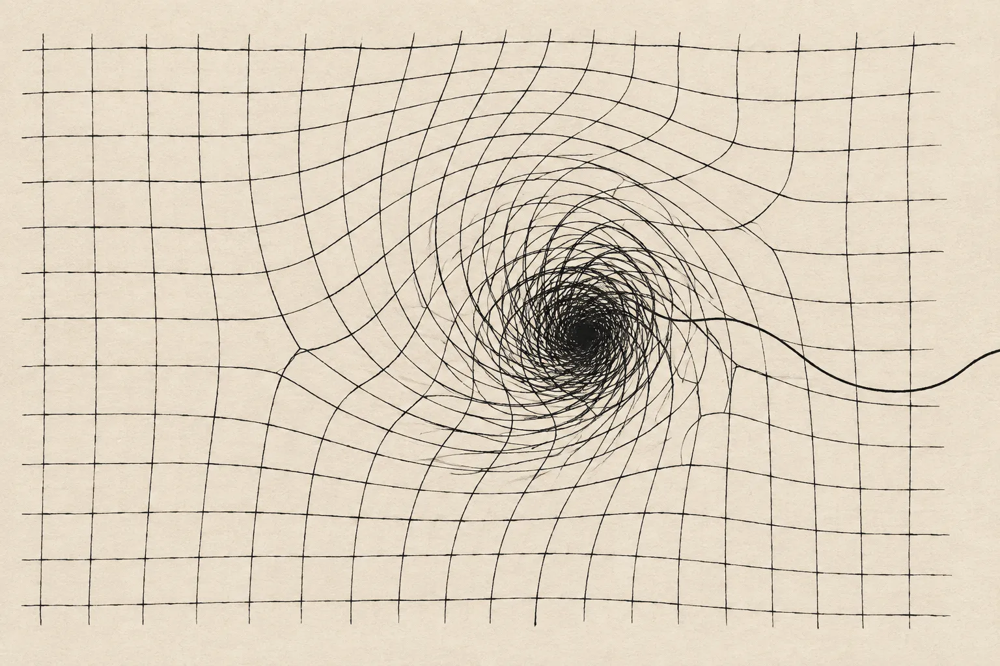

> 本文转载并翻译自 Sunil Pai 的博客文章：  
> 原文：[the senior engineer death spiral](https://sunilpai.dev/posts/the-senior-engineer-death-spiral/) (Published on September 19, 2026)  
> 作者：Sunil Pai  
> 副标题：on proving yourself, burning out, and being a good teammate / 论自我证明、职业倦怠以及成为一名好队友

(a friend recently got a new job, a very senior role, very well paid, and pretty different from his previous gig. he was asking me how to do a 60 to 80-hour week, how to do well enough to get promoted, etc. and as we talked, I realised he was feeling a bit of imposter syndrome and really wanted to prove himself. I ended up giving him a bit of a monologue. this is more or less what I told him.)

(最近有个朋友换了新工作，职位非常资深，薪水很高，而且和他之前的工作大不相同。他来问我每周该怎么干上 60 到 80 个小时，怎么才能表现得足够出色好拿到晋升等等。随着交谈的深入，我意识到他陷入了一定程度的冒名顶替综合征（imposter syndrome），极度渴望证明自己。最后我给他讲了一长段心里话。下面大致就是我跟他说的话。)

---

okay, so this is the most common failure mode I’ve seen. I call it the senior engineer death spiral. it usually happens when an engineer goes into a new job, gets a promotion, or even just gets a big project at work. or they ask for a big project because they think to themselves, “oh, if I work harder, do a bigger thing, then I will be rewarded with promotions and what have you,” right? like, that’s the move. and the thing they do is they tell themselves they need to almost cosplay being a more senior engineer than they are. they’re like, “oh, you know what, I’m going to try designing something way more ambitious.”

好的，这就是我见过最常见的失败模式。我把它叫做“资深工程师的死亡螺旋”（senior engineer death spiral）。它通常发生在工程师刚跳槽到新岗位、刚拿到晋升，或者在工作中刚接手一个大项目的时候。又或者他们主动去揽一个大项目，因为心里会想：“噢，如果我更拼命地工作，做一件更大的事情，我就能得到晋升以及一切我想要的东西，对吧？”在他们看来，这就是标准操作。于是他们做出的举动，就是暗示自己必须去“角色扮演”（cosplay）一个比自己实际水平还要资深得多的工程师。他们会想：“噢，你猜怎么着，我要去尝试设计一个宏大得多的方案。”

and what happens is they start disappearing for longer periods of time. like, for two, three weeks, you won’t hear anything from them. occasionally, during the standup, they’ll give what I call the positive update. “yeah, things are going well, you guys. I’ll have something to show you quite soon. if you have any questions, reach out.” and no one usually reaches out, but they won’t really have anything to show.

接下来的情况是，他们开始长时间处于“失联”状态。比如两三周时间里，你根本听不到他们的任何动静。偶尔在站会上，他们会给出我称之为“虚饰太平”（positive update）的同步：“大家放心，进展都很顺利。我很快就会有东西拿出来展示了。如果大家有什么问题，随时找我聊。”通常不会有人找他们，但实际上他们也根本拿不出任何可以展示的东西。

and in the back of their head, right, they’ve started the spiral already. they’re telling themselves, “oh my god, I haven’t really shipped anything in a while. what I need to do is work harder. I’ll just work hard enough. I’ll save this and no one will know.” like, “in the next week, I’ll do a whole month’s work. and no one will know.” they’ll start losing sleep, all of that. and it sucks, because bro, they start getting depressed, missing meals. their relationships suffer, both work and personal. and they just start spiraling, spiraling, and it ends up in worst-case scenarios. they burn out, they need to take a month off, they get PIP’d, they get fired, they quit their jobs because they think, “you know what, this is not salvageable.” and it really sucks.

而在他们的脑海深处，死亡螺旋已经开始了。他们会暗自抓狂：“天呐，我已经好一阵子没交付出什么实质性东西了。我必须得更拼命才行。只要我拼尽全力，我就能挽救这一切，而且谁也不会察觉。”比如，“下周我要把整整一个月的工作量全赶出来，神不知鬼不觉。”他们开始失眠，各种问题接踵而至。这非常糟糕，兄弟，因为他们开始变得抑郁、不按时吃饭；人际关系恶化，无论是在工作上还是在个人生活里。他们就这么一路螺旋下坠、恶性循环，最终走向最坏的结局：他们彻底心力交瘁（burn out），不得不请一个月长假；他们背上绩效改进计划（PIP）；被解雇；或者主动辞职，因为他们觉得“事情已经无力回天了”。这真的太令人难受了。

and by the way, this isn’t something that I’ve noticed only with other people. this has happened to me. and it’s happened so many times that I now recognize it early enough to take a step back and fix it.

顺便说一句，这不仅是我在别人身上观察到的现象，它也发生在我自己身上过。而且发生过很多次，以至于我现在能够很早识别出苗头，及时后退一步并加以纠正。

see, man, the bigger point here is that because of COVID and coding agents and remote work, things that have happened in the last five to ten years, right, you don’t really have the same structure of working next to someone and being given Jira tasks, etc. you have a lot more ownership, and you are unfortunately a little more siloed. so you never want to be in a situation where people don’t know what’s up with you. like, they shouldn’t be saying, “yeah, I don’t know what Sunil’s been doing,” and starting to get concerned, because they might only tell you when it’s too late. you want to be in a position where “Sunil doesn’t shut the fuck up about what he’s working on,” right? again, you don’t have to be obnoxious about it. you have to share your work.

你看，老兄，这里更关键的一点在于：因为疫情、AI 编程助手（coding agents）以及远程办公等过去五到十年里发生的事情，你不再拥有以前那种坐在别人身旁工作、被动分配 Jira 任务的组织结构了。你拥有了更多的自主权（ownership），但遗憾的是，你也更容易陷入信息孤岛。所以你绝不能让自己处于“别人不知道你在干嘛”的处境。大家不应该在私下议论：“哎，我完全不知道 Sunil 最近在搞什么”，然后开始心生疑虑，因为等他们真正向你指出问题时，往往已经太迟了。你应该处于这样一种状态——“Sunil 简直一直在滔滔不绝地讲他手头在做的工作”，对吧？当然，你完全不需要做得令人讨厌。你只是必须把自己的工作公开分享出来。

I think in moments like this, the thing you need to do is actually a little counterintuitive. but you have to start from a position of assuming that everyone around you is operating in good faith, okay? like, they hired you for you. they didn’t hire you for who you think you’re going to be in six months. they like you for who you are right now, bro.

我认为在这种时刻，你真正需要做的事情其实有点反直觉。但你必须从一个基本前提开始：假设你周围的每个人都是出于善意在与你合作，好吗？他们招你进来，是因为看中了真实的你。他们雇你并不是为了你臆想中“六个月后脱胎换骨的那个超人”。老兄，他们认可并喜欢的是此时此刻的你。

so the thing to do is actually to drop a level. not to try to be a higher-level engineer, but to almost drop a level and simply become the greatest teammate for a while. you’re still responsible for your work, you’re just trying to get moving again. you know, “I’m just here to help and support my teammates. I’m going to do bugs, the annoying things on somebody else’s plate or that no one has been able to get to. do grunt work, organizational stuff, write-ups. just things to help people out.”

所以真正该做的，其实是“降一级”（drop a level）。不是硬撑着去装一个更高层级的工程师，而是近乎放低姿态，在一段时间内踏踏实实去做一个最棒的队友。你依然对自己的工作负责，你只是在努力让自己重新运转起来。就像这样：“我来这里就是为了协助和支持我的队友。我去修 bug，去处理别人手头那些令人头疼的杂活，或者那些一直没人顾得上处理的积压任务；去做脏活累活、做组织协调、写文档总结，只求切实帮到大家。”

and the reason you want to do this is you want to move away from an outcome-based mindset to momentum-based. like, you want to build a routine, because momentum is everything in this, and relationships are an even bigger thing in this. and by getting momentum going and fixing your relationships with other people, the thing you get is stamina. and that’s when you realize the real lesson, which is that big projects are not done with big efforts. it’s a big marathon, just slow, steady, incremental work. forget about a weekly basis, like a daily basis, an hourly basis, to the point that it’s muscle memory.

你之所以要这么做，是因为你需要把自己的心态从“结果导向”切换为“动量导向”（momentum-based）。你必须建立起日常节奏，因为在这一过程中，动量就是一切，而人际关系则是比动量更加举足轻重的东西。通过跑动起来获得动量，并通过修补与同事的协作关系，你所收获的正是耐力（stamina）。到那时你才会领悟到真正的一课：大项目绝不是靠毕其功于一役的猛力冲刺完成的。它是一场漫长的马拉松，需要的是缓慢、稳健、增量式的持续推进。别再以周为单位去规划了，要以天为单位，甚至以小时为单位，直到它融入你的肌肉记忆。

you’re in automatic mode. you wake up, you make yourself coffee, you get to work, and you just do the work. and then 30 days later, you look back and you see the immense volume of work that you’ve done just by doing a little bit every day. because the thing you’re going for is reliability, fixing your relationships. you want to take the burden off your teammates and your manager, because then, once you build that trust, they will give you bigger work. that’s the move here.

你进入了自动运行模式。清晨醒来，给自己泡杯咖啡，开始坐下办公，把眼前的工作一件件做完。三十天后回头看，你会发现仅仅依靠每天往前推进一步，你竟然已经完成了如此庞大的工作量。因为你真正追求的是可靠性，是改善并巩固团队关系。你替你的队友和你的主管分担了压力；而一旦建立起了这份信任，他们自然会把更重大的项目交托给你。这才是正解。

remember, you are in the reputation-building business, and software is actually downstream of that. godspeed and best of luck.

记住，你从事的本质上是“建立声誉”的行当，写软件其实只是建立声誉的下游产物而已。祝你一路顺遂，万事胜意。
